# Architecture Documentation (Arc42)

**Project**: WebSocket Swing — Allegro Modernization PoC  
**Repository**: `ismailcap-coder/webscoket_swing`  
**Version**: 0.0.1-SNAPSHOT  
**Date**: 2025-01-30  
**Generated by**: Arc42 Documentation Generator  
**Domain**: German Public Administration / Social Insurance  

---

## Table of Contents

1. [Introduction and Goals](#1-introduction-and-goals)
2. [Architecture Constraints](#2-architecture-constraints)
3. [System Scope and Context](#3-system-scope-and-context)
4. [Solution Strategy](#4-solution-strategy)
5. [Building Block View](#5-building-block-view)
6. [Runtime View](#6-runtime-view)
7. [Deployment View](#7-deployment-view)
8. [Cross-cutting Concepts](#8-cross-cutting-concepts)
9. [Architecture Decisions](#9-architecture-decisions)
10. [Quality Requirements](#10-quality-requirements)
11. [Risks and Technical Debt](#11-risks-and-technical-debt)
12. [Glossary](#12-glossary)

---

## 1. Introduction and Goals

### 1.1 Overview

**WebSocket Swing** is a Proof-of-Concept (PoC) system that demonstrates a **hybrid legacy modernization strategy** for the **ALLEGRO** case management system used in German public administration and social insurance offices (Sozialversicherung / Jobcenter). 

The core idea is radical: instead of replacing the legacy Java Swing desktop application outright — a costly and risky "big bang" rewrite — this PoC proves that a **modern web frontend (Vue.js) can drive a legacy Swing desktop application in real-time via a WebSocket relay**. This is the "strangler fig" pattern applied at the UI layer.

ALLEGRO is a complex desktop application used for managing citizens' case records, payment recipients (Zahlungsempfänger), and benefit disbursements. The PoC targets the specific user workflow of:

1. **Searching** for a person (citizen/beneficiary) in the modern web UI
2. **Selecting** a payment recipient (IBAN/BIC entry) via the web interface
3. **Pushing** the selected data into the legacy Swing desktop's text fields via WebSocket
4. **Mirroring** free-form text notes between the web UI and the Swing window in real time

A secondary component demonstrates a **refactored MVP architecture** for the Swing client itself, proving that the legacy code can be gradually restructured without discarding it entirely.

### 1.2 Requirements Overview

#### Functional Requirements

| ID | Requirement | Status |
|----|-------------|--------|
| FR-01 | Search for persons by name, first name, ZIP code, city, street address | ✅ Implemented (in-memory mock) |
| FR-02 | Display search results in a tabular view | ✅ Implemented |
| FR-03 | Select a person and view their Zahlungsempfänger (payment recipients) | ✅ Implemented |
| FR-04 | Transfer selected person + payment recipient data to ALLEGRO Swing UI | ✅ Implemented via WebSocket |
| FR-05 | Real-time bidirectional text area synchronization | ✅ Implemented |
| FR-06 | Form data submission to backend service | ✅ Implemented (MVP PoC, HTTPBin echo) |
| FR-07 | Gender selection (Weiblich/Männlich/Divers) | ✅ Implemented in both UIs |
| FR-08 | Persistent ALLEGRO session while WebSocket is alive | ✅ Implemented via CountDownLatch |
| FR-09 | Real backend data source integration | ❌ Not implemented (mock data only) |
| FR-10 | Authentication and authorization | ❌ Not implemented |

#### Non-functional Requirements

| ID | Requirement | Priority | Status |
|----|-------------|----------|--------|
| NFR-01 | Sub-second latency for WebSocket message delivery | High | ✅ Achieved (local network) |
| NFR-02 | Concurrent multi-client WebSocket support | Medium | ✅ Implemented (broadcast to all) |
| NFR-03 | No modification to ALLEGRO's core business logic | High | ✅ Satisfied (Swing UI only touched) |
| NFR-04 | Developer onboarding under 30 minutes | Medium | ⚠️ Partially (no automated setup) |
| NFR-05 | Zero authentication overhead for PoC | Low | ✅ Accepted for PoC scope |

### 1.3 Quality Goals

The following quality goals are ordered by priority for this PoC:

| Priority | Quality Goal | Motivation | Scenario |
|----------|-------------|------------|---------|
| 1 | **Proof of Concept Validity** | Prove the WebSocket bridge approach is technically feasible | Data entered in Vue.js appears in ALLEGRO Swing fields within 1 second |
| 2 | **Maintainability** | New developers must understand the architecture quickly | Any Java/JS developer understands the data flow within 1 hour of reading this doc |
| 3 | **Extensibility** | The MVP pattern must allow adding new ALLEGRO fields without architectural changes | Adding a new field requires only model enum + view widget + binding — no structural change |
| 4 | **Correctness** | Data transferred must exactly match what was selected in the web UI | All 10 person fields appear correctly populated after "Nach ALLEGRO übernehmen" |
| 5 | **Operability** | The PoC must run on a developer workstation with standard tools | System starts with 3 commands: Docker, Node, Java |

### 1.4 Stakeholders

| Role | Name/Group | Expectations | Concerns |
|------|-----------|--------------|---------|
| **Product Owner** | Public Administration IT Department | Modernization roadmap validated; web UI feasibility proven | Risk of Swing destabilization |
| **Legacy Developers** | Java/Swing backend team | Existing ALLEGRO codebase preserved; incremental migration path | Learning curve for WebSocket/Vue.js |
| **Web Developers** | Frontend team | Clean Vue.js component API; standard WebSocket protocol | IE/legacy browser support (N/A for PoC) |
| **Architecture Review** | Enterprise Architects | ADR documentation; clear technology choices | Vendor lock-in; protocol standardization |
| **End Users** | Sozialversicherung clerks | Faster data entry; no disruption to daily workflow | Data accuracy; screen transitions |
| **Operations** | IT Operations | Docker-based deployment; minimal infrastructure change | Port management (1337, 8080) |
| **Security** | CISO / Data Protection Officer | Citizen data must never leave the local network | No authentication in PoC — must be added before production |

---

## 2. Architecture Constraints

### 2.1 Technical Constraints

| ID | Constraint | Rationale | Impact |
|----|-----------|-----------|--------|
| TC-01 | **Java 22 minimum** | Modern language features (unnamed variables `_`, pattern matching) used in MVP PoC | CI/CD pipeline and all developer workstations must have JDK 22+ |
| TC-02 | **Maven build system** | Established in `pom.xml`; standard for Java enterprise | No Gradle; dependency management via Maven Central |
| TC-03 | **JSR-356 WebSocket API (javax.websocket)** | Java EE WebSocket standard; Tyrus 1.15 as standalone client | Cannot use Jakarta EE 9+ `jakarta.websocket` namespace without migration |
| TC-04 | **Tyrus Standalone Client 1.15** | Only WebSocket client that works without a full Java EE container | Specific Tyrus version pinned; upgrading may break API compatibility |
| TC-05 | **javax.json 1.1.4 / 1.0.4** | JSON streaming API used for manual parsing | Cannot use Jackson or Gson without adding Maven dependency |
| TC-06 | **Vue.js 2.6 (not Vue 3)** | Vue CLI 4 scaffold; template syntax differences between v2 and v3 | Vue 2 reached end-of-life December 2023; migration required before production |
| TC-07 | **Node.js WebSocket server** | `websocket` npm package v1.0.35 | Specific npm package API; not compatible with `ws` package without rewrite |
| TC-08 | **Port 1337** | WebSocket server hardcoded port | Firewall rules and developer workstations must allow port 1337 |
| TC-09 | **Port 8080** | Vue.js dev server AND HTTPBin Docker container share port 8080 | Conflict: both cannot run simultaneously on the same host |
| TC-10 | **localhost-only URLs** | All URLs hardcoded to `localhost` | Cannot deploy to distributed environment without code changes |
| TC-11 | **Docker for HTTPBin** | `kennethreitz/httpbin` Docker image required | Docker Desktop must be installed on developer workstations |

### 2.2 Organizational Constraints

| ID | Constraint | Rationale |
|----|-----------|-----------|
| OC-01 | **PoC Scope Only** | This repository is explicitly a proof-of-concept; no production deployment authorization |
| OC-02 | **No External Dependencies** | All mock data is in-memory; no database connection to real ALLEGRO backend |
| OC-03 | **German Language Domain** | UI labels and domain terms are in German (Vorname, Name, PLZ, Ort, etc.) |
| OC-04 | **Single Developer PoC** | No team processes (PR reviews, CI/CD pipelines, automated tests) established |
| OC-05 | **GDPR Compliance Deferred** | Mock data only; GDPR impact assessment required before using real citizen data |

### 2.3 Conventions

| Convention | Description |
|-----------|-------------|
| **Package naming** | `websocket.*` for legacy WebSocket client; `com.poc.*` for MVP refactoring |
| **German field names** | Domain model uses German abbreviated field names: `knr` (Kundennummer), `dob` (date of birth), `ort` (city), `ze_*` prefix for Zahlungsempfänger fields |
| **Vue.js SFC** | Single File Components (.vue) with `<template>`, `<script>`, `<style scoped>` blocks |
| **JSON message envelope** | All WebSocket messages use `{ target: string, content: any }` envelope |
| **ModelProperties enum** | All model fields exposed as enum constants in `ModelProperties.java` |
| **ValueModel generic wrapper** | All model fields wrapped in `ValueModel<T>` for type safety |
| **EventEmitter pattern** | Events use `String` as payload type; no typed events |

---

## 3. System Scope and Context

### 3.1 Business Context

The system sits at the intersection of **modern web technology** and **legacy desktop infrastructure** in a German public administration office. The primary business driver is reducing data entry time and errors by allowing case workers to use a modern search interface while ALLEGRO (the authoritative system of record) receives the selected data automatically.

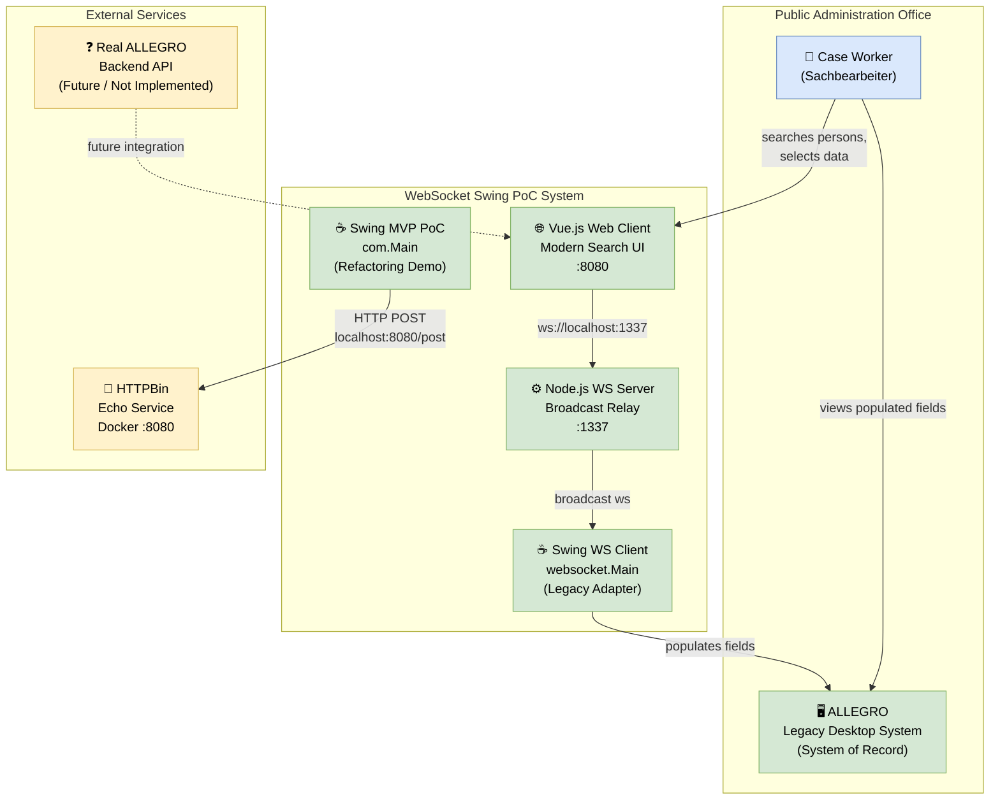
```mermaid
graph TB
    classDef actor fill:#dae8fc,stroke:#6c8ebf,color:#000
    classDef system fill:#d5e8d4,stroke:#82b366,color:#000
    classDef external fill:#fff2cc,stroke:#d6b656,color:#000
    classDef boundary fill:#f8cecc,stroke:#b85450,color:#000

    subgraph "Public Administration Office"
        CW["👤 Case Worker<br/>(Sachbearbeiter)"]
        ALLG["🖥️ ALLEGRO<br/>Legacy Desktop System<br/>(System of Record)"]
    end

    subgraph "WebSocket Swing PoC System"
        VUE["🌐 Vue.js Web Client<br/>Modern Search UI<br/>:8080"]
        NODE["⚙️ Node.js WS Server<br/>Broadcast Relay<br/>:1337"]
        SWING_WS["☕ Swing WS Client<br/>websocket.Main<br/>(Legacy Adapter)"]
        SWING_MVP["☕ Swing MVP PoC<br/>com.Main<br/>(Refactoring Demo)"]
    end

    subgraph "External Services"
        HTTPBIN["🐳 HTTPBin<br/>Echo Service<br/>Docker :8080"]
        BACKEND["❓ Real ALLEGRO<br/>Backend API<br/>(Future / Not Implemented)"]
    end

    CW -->|"searches persons,<br/>selects data"| VUE
    CW -->|"views populated fields"| ALLG
    VUE -->|"ws://localhost:1337"| NODE
    NODE -->|"broadcast ws"| SWING_WS
    SWING_WS -->|"populates fields"| ALLG
    SWING_MVP -->|"HTTP POST<br/>localhost:8080/post"| HTTPBIN
    BACKEND -.->|"future integration"| VUE

    class CW actor
    class ALLG,VUE,NODE,SWING_WS,SWING_MVP system
    class HTTPBIN,BACKEND external
```

**Business Context Description:**

| System/Actor | Role | Interaction |
|-------------|------|-------------|
| **Case Worker (Sachbearbeiter)** | Primary user; enters search criteria in web UI, selects results | Operates both the Vue.js browser tab and the ALLEGRO Swing window |
| **Vue.js Web Client** | Modern search frontend; in-memory person database | Sends WebSocket messages upon user action |
| **Node.js WS Server** | Pure relay; no business logic | Broadcasts any received message to all connected clients |
| **Swing WS Client** | WebSocket listener; populates ALLEGRO's text fields | Translates JSON messages into Swing UI field updates |
| **ALLEGRO** | Legacy case management system; authoritative data store | Receives populated data; continues normal operation |
| **HTTPBin** | Echo service for MVP form submission test | Returns submitted JSON for validation |
| **Real ALLEGRO Backend** | Future integration target | Not implemented; currently replaced by in-memory mock |

### 3.2 Technical Context

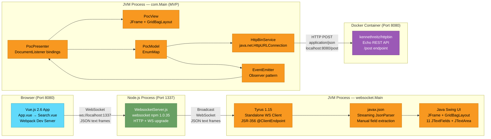
```mermaid
graph LR
    classDef webtech fill:#61dafb,stroke:#20a0c0,color:#000
    classDef javatech fill:#f89820,stroke:#c07000,color:#000
    classDef nodetech fill:#68a063,stroke:#3d7a40,color:#fff
    classDef infra fill:#9b59b6,stroke:#6c3483,color:#fff
    classDef protocol fill:#e74c3c,stroke:#a93226,color:#fff

    subgraph "Browser (Port 8080)"
        VUE_APP["Vue.js 2.6 App<br/>App.vue → Search.vue<br/>Webpack Dev Server"]
    end

    subgraph "Node.js Process (Port 1337)"
        WS_SERVER["WebsocketServer.js<br/>websocket npm 1.0.35<br/>HTTP + WS upgrade"]
    end

    subgraph "JVM Process — websocket.Main"
        TYRUS["Tyrus 1.15<br/>Standalone WS Client<br/>JSR-356 @ClientEndpoint"]
        JSON_PARSE["javax.json<br/>Streaming JsonParser<br/>Manual field extraction"]
        SWING_UI["Java Swing UI<br/>JFrame + GridBagLayout<br/>11 JTextFields + JTextArea"]
    end

    subgraph "JVM Process — com.Main (MVP)"
        MVP_VIEW["PocView<br/>JFrame + GridBagLayout"]
        MVP_PRES["PocPresenter<br/>DocumentListener bindings"]
        MVP_MODEL["PocModel<br/>EnumMap<ModelProperties, ValueModel>"]
        HTTP_SVC["HttpBinService<br/>java.net.HttpURLConnection"]
        EVT_EMIT["EventEmitter<br/>Observer pattern"]
    end

    subgraph "Docker Container (Port 8080)"
        HTTPBIN["kennethreitz/httpbin<br/>Echo REST API<br/>/post endpoint"]
    end

    VUE_APP -- "WebSocket\nws://localhost:1337\nJSON text frames" --> WS_SERVER
    WS_SERVER -- "Broadcast\nWebSocket\nJSON text frames" --> TYRUS
    TYRUS --> JSON_PARSE
    JSON_PARSE --> SWING_UI
    MVP_PRES --> MVP_MODEL
    MVP_PRES --> MVP_VIEW
    MVP_MODEL --> HTTP_SVC
    MVP_MODEL --> EVT_EMIT
    EVT_EMIT --> MVP_PRES
    HTTP_SVC -- "HTTP POST\napplication/json\nlocalhost:8080/post" --> HTTPBIN

    class VUE_APP webtech
    class WS_SERVER nodetech
    class TYRUS,JSON_PARSE,SWING_UI,MVP_VIEW,MVP_PRES,MVP_MODEL,HTTP_SVC,EVT_EMIT javatech
    class HTTPBIN infra
```

**Technical Interfaces:**

| Interface | Protocol | Format | Direction | Parties |
|-----------|----------|--------|-----------|---------|
| **WS-01** | WebSocket (RFC 6455) | JSON text frame | Vue.js → Node.js → Swing | All components |
| **WS-02** | WebSocket upgrade over HTTP | HTTP 1.1 Upgrade | Browser → Node.js | Vue.js ↔ WS Server |
| **HTTP-01** | HTTP/1.1 POST | `application/json` | Swing MVP → HTTPBin | com.poc → Docker |
| **UI-01** | Swing event dispatch thread | Java AWT events | Internal | PocPresenter → PocModel |
| **UI-02** | Swing repaint | AWT/EDT | Internal | WebSocket callback → JTextField |

**WebSocket Message Envelope:**
```json
{
  "target": "textfield" | "textarea",
  "content": { /* person object */ } | "string"
}
```

**Person Object (textfield content):**
```json
{
  "first": "Hans",
  "name": "Mayer",
  "dob": "1981-01-08",
  "zip": "95183",
  "ort": "Trogen",
  "street": "Isaaer Str.",
  "hausnr": "23",
  "knr": "79423984",
  "zahlungsempfaenger": {
    "iban": "DE27100777770209299700",
    "bic": "ERFBDE8E759",
    "valid_from": "2020-01-04",
    "valid_until": "",
    "type": ""
  }
}
```

---

## 4. Solution Strategy

### 4.1 Core Architectural Decision: WebSocket Relay Bridge

The central innovation of this PoC is the **WebSocket relay bridge pattern**. Rather than modifying ALLEGRO's internal data model or APIs (which may not exist or be accessible), the approach hooks into the **presentation layer** from outside:

```
[Modern Web UI] → [WebSocket Relay] → [Legacy Swing UI auto-population]
```

This is architecturally similar to **robotic process automation (RPA)** but implemented at the code level rather than pixel-scraping. The Swing application opts *into* the integration by embedding a WebSocket client.

### 4.2 Technology Decisions

| Decision | Choice | Rationale | Alternative Considered |
|---------|--------|-----------|----------------------|
| **Web Frontend** | Vue.js 2.6 | Lightweight, reactive, easy component model; low learning curve | React (higher complexity), Angular (heavyweight) |
| **Relay Server** | Node.js + `websocket` npm | Zero-overhead broadcast relay; minimal code; JS runtime already needed for Vue | Java Netty (heavier), Spring WebSocket (overkill for relay) |
| **Java WS Client** | Tyrus 1.15 Standalone | JSR-356 compliant; works without Java EE container; annotation-driven | Java 11+ HttpClient WebSocket (newer but less mature at time) |
| **JSON Processing** | javax.json streaming API | Zero extra dependency (already in POM); streaming avoids memory overhead | Jackson ObjectMapper (cleaner but adds 2MB JAR), Gson |
| **MVP Pattern** | Model-View-Presenter | Clear separation for Swing refactoring; testable presenter; no framework needed | MVC (harder to test Swing), MVVM (not natural for Swing) |
| **Observer/EventEmitter** | Custom Java EventEmitter | Decouples model from presenter; simple subscription model | Java PropertyChangeListener (verbose), RxJava (heavyweight) |
| **HTTP Echo** | kennethreitz/httpbin Docker | Zero-effort echo server; proves HTTP integration; standard container | Mock server (more setup), Spring Boot stub (more code) |
| **Build tool** | Maven | Standard in Java enterprise; `pom.xml` already established | Gradle (modern but different learning curve) |

### 4.3 Top-Level Decomposition Strategy

The system decomposes along **technology runtime boundaries** rather than business layers:

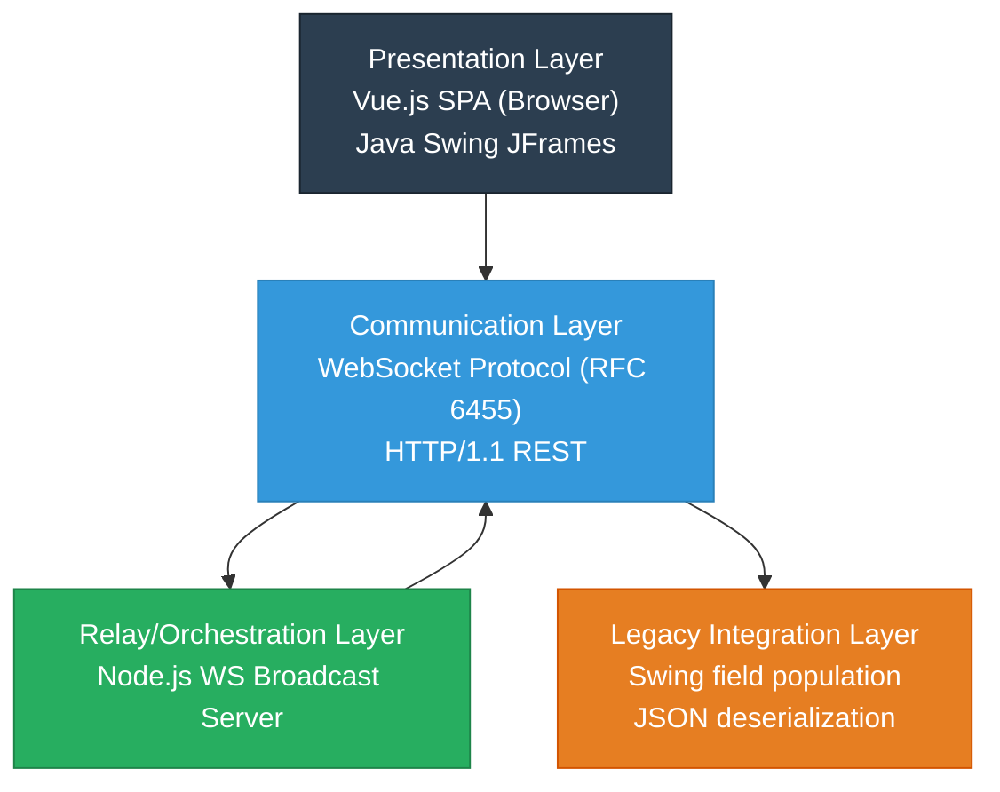
```mermaid
graph TB
    classDef layer1 fill:#2c3e50,stroke:#1a252f,color:#fff
    classDef layer2 fill:#3498db,stroke:#2980b9,color:#fff
    classDef layer3 fill:#27ae60,stroke:#1e8449,color:#fff
    classDef layer4 fill:#e67e22,stroke:#d35400,color:#fff

    L1["Presentation Layer<br/>Vue.js SPA (Browser)<br/>Java Swing JFrames"]
    L2["Communication Layer<br/>WebSocket Protocol (RFC 6455)<br/>HTTP/1.1 REST"]
    L3["Relay/Orchestration Layer<br/>Node.js WS Broadcast Server"]
    L4["Legacy Integration Layer<br/>Swing field population<br/>JSON deserialization"]

    L1 --> L2
    L2 --> L3
    L3 --> L2
    L2 --> L4

    class L1 layer1
    class L2 layer2
    class L3 layer3
    class L4 layer4
```

### 4.4 Approaches to Achieve Quality Goals

| Quality Goal | Approach |
|-------------|---------|
| **PoC Validity** | End-to-end integration test manually verifiable in < 5 minutes on any workstation |
| **Maintainability** | MVP pattern separates view/model/presenter; EventEmitter decouples model events |
| **Extensibility** | Adding a new field: (1) add `ModelProperties` enum value, (2) add `JTextField` to `PocView`, (3) call `bind()` in `PocPresenter` |
| **Correctness** | Deep copy (`JSON.parse(JSON.stringify(e))`) before sending prevents mutation side effects |
| **Operability** | 3-step startup (Docker, Node, Java); no database seeding; no config files |

---

## 5. Building Block View

### 5.1 Level 1: Whitebox Overall System

The system consists of **four independently runnable processes** that communicate via network protocols:

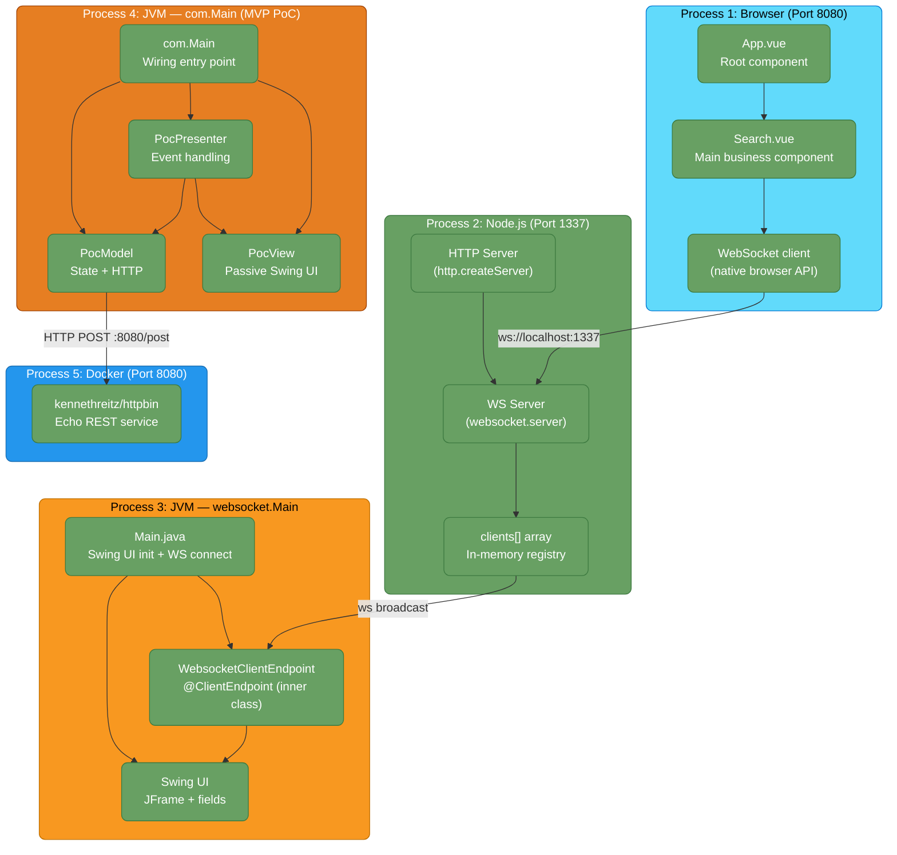
```mermaid
graph TB
    classDef browser fill:#61dafb,stroke:#0078d4,color:#000,rx:8
    classDef node fill:#68a063,stroke:#3d7a40,color:#fff,rx:8
    classDef jvm1 fill:#f89820,stroke:#c07000,color:#000,rx:8
    classDef jvm2 fill:#e67e22,stroke:#a04000,color:#fff,rx:8
    classDef docker fill:#2496ed,stroke:#1a6fb5,color:#fff,rx:8

    subgraph PROC1["Process 1: Browser (Port 8080)"]
        direction TB
        P1A["App.vue<br/>Root component"]
        P1B["Search.vue<br/>Main business component"]
        P1C["WebSocket client<br/>(native browser API)"]
        P1A --> P1B
        P1B --> P1C
    end

    subgraph PROC2["Process 2: Node.js (Port 1337)"]
        direction TB
        P2A["HTTP Server<br/>(http.createServer)"]
        P2B["WS Server<br/>(websocket.server)"]
        P2C["clients[] array<br/>In-memory registry"]
        P2A --> P2B
        P2B --> P2C
    end

    subgraph PROC3["Process 3: JVM — websocket.Main"]
        direction TB
        P3A["Main.java<br/>Swing UI init + WS connect"]
        P3B["WebsocketClientEndpoint<br/>@ClientEndpoint (inner class)"]
        P3C["Swing UI<br/>JFrame + fields"]
        P3A --> P3B
        P3A --> P3C
        P3B --> P3C
    end

    subgraph PROC4["Process 4: JVM — com.Main (MVP PoC)"]
        direction TB
        P4A["com.Main<br/>Wiring entry point"]
        P4B["PocView<br/>Passive Swing UI"]
        P4C["PocPresenter<br/>Event handling"]
        P4D["PocModel<br/>State + HTTP"]
        P4A --> P4B
        P4A --> P4C
        P4A --> P4D
        P4C --> P4B
        P4C --> P4D
    end

    subgraph PROC5["Process 5: Docker (Port 8080)"]
        P5A["kennethreitz/httpbin<br/>Echo REST service"]
    end

    P1C -- "ws://localhost:1337" --> P2B
    P2C -- "ws broadcast" --> P3B
    P4D -- "HTTP POST :8080/post" --> P5A

    class PROC1 browser
    class PROC2 node
    class PROC3 jvm1
    class PROC4 jvm2
    class PROC5 docker
```

**Contained Building Blocks (Level 1):**

| Block | Technology | Responsibility | Interfaces |
|-------|-----------|----------------|-----------|
| **Vue.js SPA** | Vue.js 2.6, Browser | Person search UI, WebSocket sender | WS out to Node.js |
| **Node.js WS Server** | Node.js, `websocket` v1.0.35 | Broadcast relay; client registry | WS in/out |
| **Swing WS Client** (`websocket.Main`) | Java 22, Tyrus, Swing | WebSocket receiver; field population | WS in; Swing UI |
| **Swing MVP PoC** (`com.Main`) | Java 22, Swing, javax.json | MVP demonstration; HTTP form submit | HTTP out |
| **HTTPBin Docker** | Docker, Python (Flask) | Echo service for HTTP testing | HTTP in/out |

### 5.2 Level 2: Vue.js SPA Component Structure

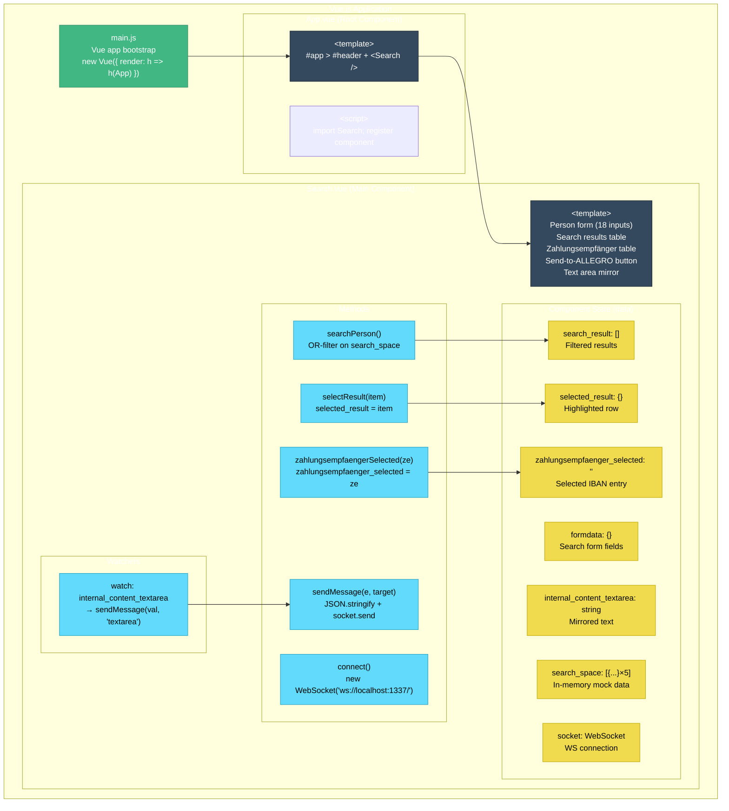
```mermaid
graph TB
    classDef root fill:#41b883,stroke:#2d8a60,color:#fff
    classDef comp fill:#35495e,stroke:#1a2530,color:#fff
    classDef data fill:#f0db4f,stroke:#c0a800,color:#000
    classDef method fill:#61dafb,stroke:#20a0c0,color:#000

    subgraph "Vue.js Application"
        MAIN["main.js<br/>Vue app bootstrap<br/>new Vue({ render: h => h(App) })"]

        subgraph "App.vue (Root Component)"
            APP_T["&lt;template&gt;<br/>#app > #header + &lt;Search /&gt;"]
            APP_S["&lt;script&gt;<br/>import Search; register component"]
        end

        subgraph "Search.vue (Main Component)"
            TMPL["&lt;template&gt;<br/>Person form (18 inputs)<br/>Search results table<br/>Zahlungsempfänger table<br/>Send-to-ALLEGRO button<br/>Text area mirror"]

            subgraph "Component State (data)"
                DS1["formdata: {}<br/>Search form fields"]
                DS2["search_result: []<br/>Filtered results"]
                DS3["selected_result: {}<br/>Highlighted row"]
                DS4["zahlungsempfaenger_selected: ''<br/>Selected IBAN entry"]
                DS5["internal_content_textarea: string<br/>Mirrored text"]
                DS6["search_space: [{...}×5]<br/>In-memory mock data"]
                DS7["socket: WebSocket<br/>WS connection"]
            end

            subgraph "Methods"
                M1["connect()<br/>new WebSocket('ws://localhost:1337/')"]
                M2["searchPerson()<br/>OR-filter on search_space"]
                M3["selectResult(item)<br/>selected_result = item"]
                M4["zahlungsempfaengerSelected(ze)<br/>zahlungsempfaenger_selected = ze"]
                M5["sendMessage(e, target)<br/>JSON.stringify + socket.send"]
            end

            subgraph "Watchers"
                W1["watch: internal_content_textarea<br/>→ sendMessage(val, 'textarea')"]
            end
        end
    end

    MAIN --> APP_T
    APP_T --> TMPL
    M2 --> DS2
    M3 --> DS3
    M4 --> DS4
    W1 --> M5

    class MAIN root
    class APP_T,TMPL comp
    class DS1,DS2,DS3,DS4,DS5,DS6,DS7 data
    class M1,M2,M3,M4,M5,W1 method
```

### 5.3 Level 2: Node.js WebSocket Server Structure

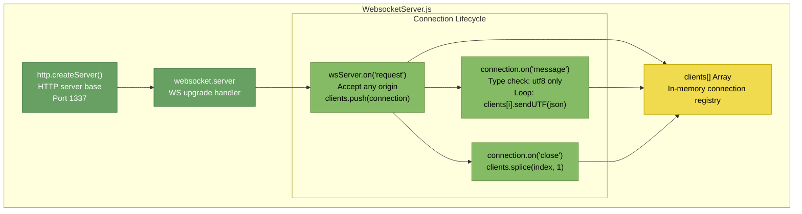
```mermaid
graph TB
    classDef server fill:#68a063,stroke:#3d7a40,color:#fff
    classDef handler fill:#85bb65,stroke:#5a8a3d,color:#000
    classDef state fill:#f0db4f,stroke:#c0a800,color:#000

    subgraph "WebsocketServer.js"
        HTTP["http.createServer()<br/>HTTP server base<br/>Port 1337"]
        WSS["websocket.server<br/>WS upgrade handler"]
        CLIENTS["clients[] Array<br/>In-memory connection registry"]
        
        subgraph "Connection Lifecycle"
            ON_REQ["wsServer.on('request')<br/>Accept any origin<br/>clients.push(connection)"]
            ON_MSG["connection.on('message')<br/>Type check: utf8 only<br/>Loop: clients[i].sendUTF(json)"]
            ON_CLOSE["connection.on('close')<br/>clients.splice(index, 1)"]
        end
    end

    HTTP --> WSS
    WSS --> ON_REQ
    ON_REQ --> CLIENTS
    ON_REQ --> ON_MSG
    ON_REQ --> ON_CLOSE
    ON_MSG --> CLIENTS
    ON_CLOSE --> CLIENTS

    class HTTP,WSS server
    class ON_REQ,ON_MSG,ON_CLOSE handler
    class CLIENTS state
```

**Key Design Notes for Node.js Server:**
- No message persistence — messages are fire-and-forget
- No message filtering — any client (including sender) receives the broadcast
- No protocol validation — accepts any origin (`null` in `request.accept`)
- No reconnection logic — client must reconnect on drop
- `messages[]` array declared but never used (dead code)

### 5.4 Level 2: Java Swing WS Client (`websocket` package)

```mermaid
classDiagram
    class Main {
        -CountDownLatch latch$
        -JFrame frame$
        -JTextArea textArea$
        -JTextField tf_name$
        -JTextField tf_first$
        -JTextField tf_dob$
        -JTextField tf_zip$
        -JTextField tf_ort$
        -JTextField tf_street$
        -JTextField tf_hausnr$
        -JTextField tf_ze_iban$
        -JTextField tf_ze_bic$
        -JTextField tf_ze_valid_from$
        -JRadioButton rb_female$
        -JRadioButton rb_male$
        -JRadioButton rb_diverse$
        -JsonParserFactory jsonParserFactory$
        +main(String[] args)$
        -initUI()$
        +toSearchResult(String json)$ SearchResult
    }

    class WebsocketClientEndpoint {
        +Session userSession
        +WebsocketClientEndpoint(URI endpointURI)
        +onOpen(Session userSession) [at]OnOpen
        +onClose(Session userSession, CloseReason reason) [at]OnClose
        +onMessage(String json) [at]OnMessage
        +sendMessage(String message)
        +extract(String json)$ Message
    }

    class Message {
        +String target
        +String content
        +Message(String target, String message)
    }

    class SearchResult {
        +String name
        +String first
        +String dob
        +String zip
        +String ort
        +String street
        +String hausnr
        +String ze_iban
        +String ze_bic
        +String ze_valid_from
    }

    Main +-- WebsocketClientEndpoint : inner class
    Main +-- Message : inner class
    Main +-- SearchResult : inner class
    WebsocketClientEndpoint --> Message : creates
    WebsocketClientEndpoint --> SearchResult : via toSearchResult()
```

### 5.5 Level 2: Java Swing MVP PoC (`com.poc` package)

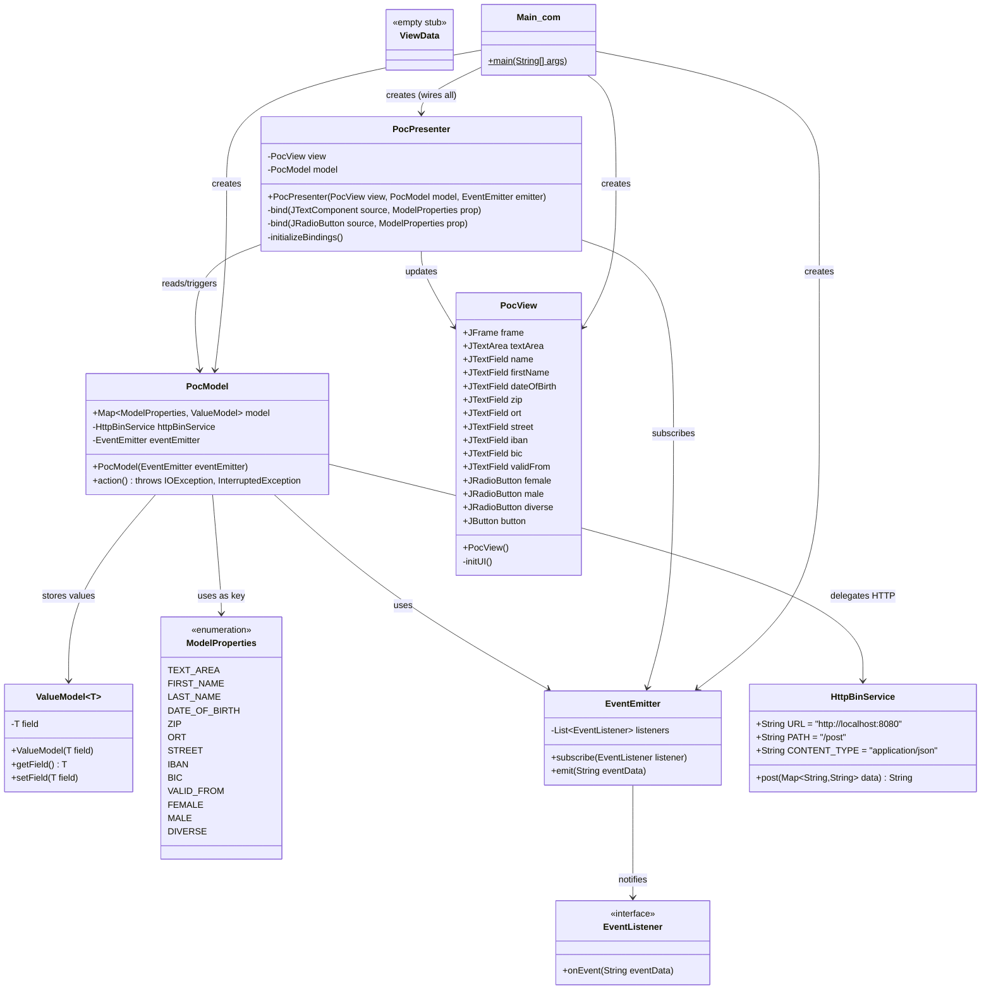
```mermaid
classDiagram
    direction TB

    class ValueModel~T~ {
        -T field
        +ValueModel(T field)
        +getField() T
        +setField(T field)
    }

    class ModelProperties {
        <<enumeration>>
        TEXT_AREA
        FIRST_NAME
        LAST_NAME
        DATE_OF_BIRTH
        ZIP
        ORT
        STREET
        IBAN
        BIC
        VALID_FROM
        FEMALE
        MALE
        DIVERSE
    }

    class EventListener {
        <<interface>>
        +onEvent(String eventData)
    }

    class EventEmitter {
        -List~EventListener~ listeners
        +subscribe(EventListener listener)
        +emit(String eventData)
    }

    class PocModel {
        +Map~ModelProperties, ValueModel~ model
        -HttpBinService httpBinService
        -EventEmitter eventEmitter
        +PocModel(EventEmitter eventEmitter)
        +action() throws IOException, InterruptedException
    }

    class HttpBinService {
        +String URL = "http://localhost:8080"
        +String PATH = "/post"
        +String CONTENT_TYPE = "application/json"
        +post(Map~String,String~ data) String
    }

    class ViewData {
        <<empty stub>>
    }

    class PocView {
        +JFrame frame
        +JTextArea textArea
        +JTextField name
        +JTextField firstName
        +JTextField dateOfBirth
        +JTextField zip
        +JTextField ort
        +JTextField street
        +JTextField iban
        +JTextField bic
        +JTextField validFrom
        +JRadioButton female
        +JRadioButton male
        +JRadioButton diverse
        +JButton button
        +PocView()
        -initUI()
    }

    class PocPresenter {
        -PocView view
        -PocModel model
        +PocPresenter(PocView view, PocModel model, EventEmitter emitter)
        -bind(JTextComponent source, ModelProperties prop)
        -bind(JRadioButton source, ModelProperties prop)
        -initializeBindings()
    }

    class Main_com {
        +main(String[] args)$
    }

    EventEmitter --> EventListener : notifies
    PocModel --> EventEmitter : uses
    PocModel --> HttpBinService : delegates HTTP
    PocModel --> ModelProperties : uses as key
    PocModel --> ValueModel : stores values
    PocPresenter --> PocView : updates
    PocPresenter --> PocModel : reads/triggers
    PocPresenter --> EventEmitter : subscribes
    Main_com --> PocView : creates
    Main_com --> EventEmitter : creates
    Main_com --> PocModel : creates
    Main_com --> PocPresenter : creates (wires all)
```

**MVP Pattern Responsibilities:**

| Layer | Class | Responsibility |
|-------|-------|----------------|
| **View** | `PocView` | Pure Swing widget container; no logic; publicly accessible fields |
| **Presenter** | `PocPresenter` | Binds View ↔ Model; handles button click; subscribes to events; updates View on response |
| **Model** | `PocModel` | Holds form state in `EnumMap`; sends HTTP request; fires `EventEmitter` on response |
| **Service** | `HttpBinService` | HTTP communication; JSON serialization; response parsing |
| **Event Bus** | `EventEmitter` | Decouples Model (producer) from Presenter (consumer) for async response handling |

---

## 6. Runtime View

### 6.1 Scenario 1: Person Search and ALLEGRO Transfer

This is the primary use case: a case worker finds a citizen in the web UI and transfers their data to ALLEGRO.

```mermaid
sequenceDiagram
    actor CW as Case Worker
    participant VUE as Vue.js<br/>Search.vue
    participant NODE as Node.js<br/>WS Server
    participant SWING as Swing<br/>websocket.Main
    participant UI as ALLEGRO<br/>Swing UI

    Note over CW,UI: Phase 1: Person Search

    CW->>VUE: Enter search criteria<br/>(name, first, ZIP, city, street)
    VUE->>VUE: searchPerson()<br/>OR-filter search_space[]
    VUE-->>CW: Display filtered results in table

    Note over CW,UI: Phase 2: Selection
    
    CW->>VUE: Click person row
    VUE->>VUE: selectResult(item)<br/>selected_result = item
    VUE-->>CW: Highlight row; show Zahlungsempfänger table

    CW->>VUE: Click IBAN/BIC row
    VUE->>VUE: zahlungsempfaengerSelected(ze)<br/>zahlungsempfaenger_selected = ze
    VUE-->>CW: Highlight selected IBAN row

    Note over CW,UI: Phase 3: ALLEGRO Transfer

    CW->>VUE: Click "Nach ALLEGRO übernehmen"
    VUE->>VUE: sendMessage(selected_result, 'textfield')
    VUE->>VUE: Deep copy: JSON.parse(JSON.stringify(e))
    VUE->>VUE: obj_to_send.zahlungsempfaenger = zahlungsempfaenger_selected
    VUE->>NODE: socket.send(JSON.stringify({<br/>  target: "textfield",<br/>  content: mergedPersonObj<br/>}))

    NODE->>NODE: message.on('message')<br/>Receive UTF-8 json
    NODE->>NODE: Loop clients[].sendUTF(json)
    NODE->>SWING: Broadcast WS message

    SWING->>SWING: @OnMessage onMessage(String json)
    SWING->>SWING: extract(json) → Message{target, content}
    SWING->>SWING: switch(message.target) → "textfield"
    SWING->>SWING: toSearchResult(message.content)
    SWING->>SWING: JsonParser streaming parse<br/>10 boolean flags → 10 string fields

    SWING->>UI: tf_name.setText(searchResult.name)
    SWING->>UI: tf_first.setText(searchResult.first)
    SWING->>UI: tf_dob.setText(searchResult.dob)
    SWING->>UI: tf_zip.setText(searchResult.zip)
    SWING->>UI: tf_ort.setText(searchResult.ort)
    SWING->>UI: tf_street.setText(searchResult.street)
    SWING->>UI: tf_hausnr.setText(searchResult.hausnr)
    SWING->>UI: tf_ze_iban.setText(searchResult.ze_iban)
    SWING->>UI: tf_ze_bic.setText(searchResult.ze_bic)
    SWING->>UI: tf_ze_valid_from.setText(searchResult.ze_valid_from)

    UI-->>CW: All fields populated in ALLEGRO window
```

**Self-Echo Side Effect:**

> ⚠️ Because the Node.js server broadcasts to **all** connected clients (including the sender), Vue.js also receives the message it sent. However, since `Search.vue` does not register an `onmessage` handler (`socket.onmessage` is commented out), the echo is silently discarded in the current implementation.

### 6.2 Scenario 2: Real-Time Text Area Mirroring

This scenario demonstrates bidirectional text synchronization — every keystroke in the Vue.js textarea is mirrored to the ALLEGRO Swing window's `JTextArea`.

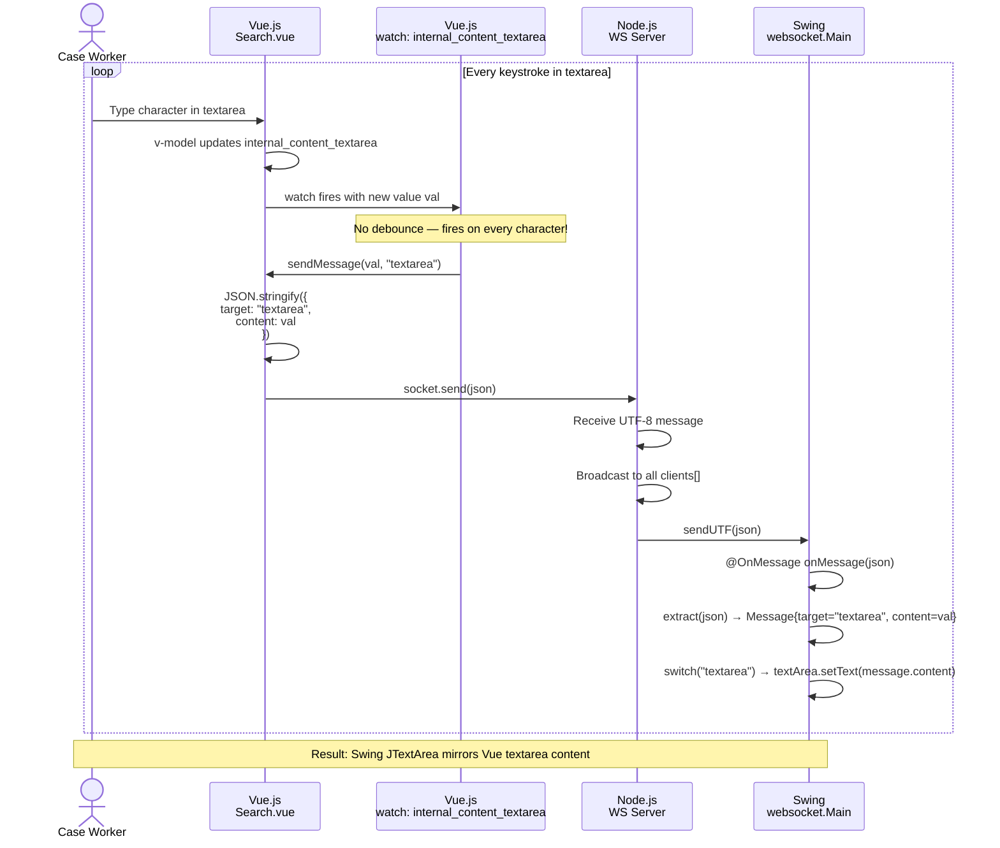
```mermaid
sequenceDiagram
    actor CW as Case Worker
    participant VUE as Vue.js<br/>Search.vue
    participant WATCHER as Vue.js<br/>watch: internal_content_textarea
    participant NODE as Node.js<br/>WS Server
    participant SWING as Swing<br/>websocket.Main

    loop Every keystroke in textarea

        CW->>VUE: Type character in textarea
        VUE->>VUE: v-model updates internal_content_textarea
        VUE->>WATCHER: watch fires with new value val

        Note over WATCHER: No debounce — fires on every character!

        WATCHER->>VUE: sendMessage(val, "textarea")
        VUE->>VUE: JSON.stringify({<br/>  target: "textarea",<br/>  content: val<br/>})
        VUE->>NODE: socket.send(json)

        NODE->>NODE: Receive UTF-8 message
        NODE->>NODE: Broadcast to all clients[]
        NODE->>SWING: sendUTF(json)

        SWING->>SWING: @OnMessage onMessage(json)
        SWING->>SWING: extract(json) → Message{target="textarea", content=val}
        SWING->>SWING: switch("textarea") → textArea.setText(message.content)

    end

    Note over CW,SWING: Result: Swing JTextArea mirrors Vue textarea content
```

**Performance Note:** Without debouncing, a user typing 50 characters triggers 50 WebSocket round-trips. On a local network this is imperceptible, but on a WAN or under load this would be problematic.

### 6.3 Scenario 3: MVP Form Submission

This scenario shows the MVP PoC's data flow from form input to HTTP echo and back to UI reset.

```mermaid
sequenceDiagram
    actor CW as Case Worker
    participant VIEW as PocView<br/>(Swing JFrame)
    participant PRES as PocPresenter<br/>(DocumentListener)
    participant MODEL as PocModel<br/>(EnumMap)
    participant HTTP as HttpBinService<br/>(HttpURLConnection)
    participant HTTPBIN as HTTPBin<br/>Docker :8080
    participant EMITTER as EventEmitter

    Note over CW,EMITTER: Phase 1: Form Filling (real-time binding)

    CW->>VIEW: Type in firstName field
    VIEW->>PRES: DocumentListener.insertUpdate(DocumentEvent)
    PRES->>PRES: e.getDocument().getText(0, length)
    PRES->>MODEL: model.get(FIRST_NAME).setField(content)

    CW->>VIEW: Click Weiblich radio button
    VIEW->>PRES: ChangeListener fires
    PRES->>MODEL: model.get(FEMALE).setField(true)

    Note over CW,EMITTER: Phase 2: Form Submission

    CW->>VIEW: Click "Anordnen" button
    VIEW->>PRES: ActionListener fires
    PRES->>MODEL: model.action()

    MODEL->>MODEL: for(ModelProperties val : values())<br/>data.put(val.toString(), model.get(val).getField().toString())
    
    Note over MODEL: ⚠️ Unsafe: Boolean.toString() called via Object.toString()
    
    MODEL->>HTTP: httpBinService.post(data)
    HTTP->>HTTP: HttpURLConnection.openConnection()
    HTTP->>HTTP: setRequestMethod("POST")
    HTTP->>HTTP: javax.json.JsonGenerator writes JSON body
    HTTP->>HTTPBIN: POST /post\nContent-Type: application/json\n{all form fields as strings}
    HTTPBIN-->>HTTP: 200 OK\n{ json: {...}, headers: {...}, ... }
    HTTP->>HTTP: Scanner reads response body
    HTTP-->>MODEL: return responseBody (String)

    MODEL->>EMITTER: eventEmitter.emit(responseBody)
    EMITTER->>PRES: listener.onEvent(responseBody)

    Note over PRES,VIEW: Phase 3: View Reset

    PRES->>VIEW: view.textArea.setText(eventData)
    PRES->>VIEW: view.firstName.setText("")
    PRES->>VIEW: view.name.setText("")
    PRES->>VIEW: view.dateOfBirth.setText("")
    PRES->>VIEW: view.zip.setText("")
    PRES->>VIEW: view.ort.setText("")
    PRES->>VIEW: view.street.setText("")
    PRES->>VIEW: view.iban.setText("")
    PRES->>VIEW: view.bic.setText("")
    PRES->>VIEW: view.validFrom.setText("")
    PRES->>VIEW: view.female.setSelected(true)
    PRES->>VIEW: view.male.setSelected(false)
    PRES->>VIEW: view.diverse.setSelected(false)

    VIEW-->>CW: Form cleared; response shown in textArea
```

### 6.4 Scenario 4: WebSocket Connection Lifecycle

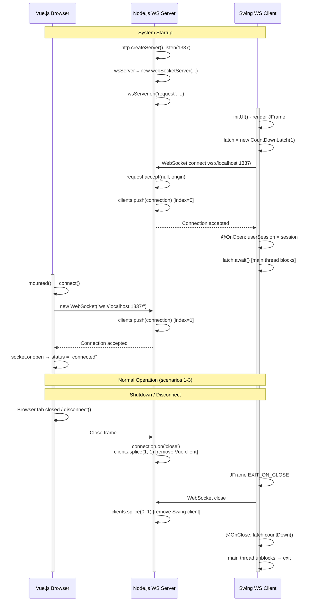
```mermaid
sequenceDiagram
    participant VUE as Vue.js Browser
    participant NODE as Node.js WS Server
    participant SWING as Swing WS Client

    Note over VUE,SWING: System Startup

    activate NODE
    NODE->>NODE: http.createServer().listen(1337)
    NODE->>NODE: wsServer = new webSocketServer(...)
    NODE->>NODE: wsServer.on('request', ...)

    activate SWING
    SWING->>SWING: initUI() - render JFrame
    SWING->>SWING: latch = new CountDownLatch(1)
    SWING->>NODE: WebSocket connect ws://localhost:1337/
    NODE->>NODE: request.accept(null, origin)
    NODE->>NODE: clients.push(connection) [index=0]
    NODE-->>SWING: Connection accepted
    SWING->>SWING: @OnOpen: userSession = session
    SWING->>SWING: latch.await() [main thread blocks]

    activate VUE
    VUE->>VUE: mounted() → connect()
    VUE->>NODE: new WebSocket("ws://localhost:1337/")
    NODE->>NODE: clients.push(connection) [index=1]
    NODE-->>VUE: Connection accepted
    VUE->>VUE: socket.onopen → status = "connected"

    Note over VUE,SWING: Normal Operation (scenarios 1-3)

    Note over VUE,SWING: Shutdown / Disconnect

    VUE->>VUE: Browser tab closed / disconnect()
    VUE->>NODE: Close frame
    NODE->>NODE: connection.on('close')<br/>clients.splice(1, 1) [remove Vue client]

    SWING->>SWING: JFrame EXIT_ON_CLOSE
    SWING->>NODE: WebSocket close
    NODE->>NODE: clients.splice(0, 1) [remove Swing client]
    SWING->>SWING: @OnClose: latch.countDown()
    SWING->>SWING: main thread unblocks → exit
    deactivate SWING
    deactivate VUE
    deactivate NODE
```

---

## 7. Deployment View

### 7.1 Infrastructure Level 1: Developer Workstation

This PoC is designed for single-workstation deployment. All components run on `localhost`.

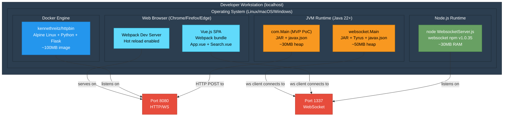
```mermaid
graph TB
    classDef os fill:#2c3e50,stroke:#1a252f,color:#fff
    classDef jvm fill:#f89820,stroke:#c07000,color:#000
    classDef node fill:#68a063,stroke:#3d7a40,color:#fff
    classDef browser fill:#61dafb,stroke:#20a0c0,color:#000
    classDef docker fill:#2496ed,stroke:#1a6fb5,color:#fff
    classDef port fill:#e74c3c,stroke:#a93226,color:#fff

    subgraph HOST["Developer Workstation (localhost)"]
        subgraph OS["Operating System (Linux/macOS/Windows)"]

            subgraph JAVA_RUNTIME["JVM Runtime (Java 22+)"]
                JVM1["websocket.Main<br/>JAR + Tyrus + javax.json<br/>~50MB heap"]
                JVM2["com.Main (MVP PoC)<br/>JAR + javax.json<br/>~30MB heap"]
            end

            subgraph NODE_RUNTIME["Node.js Runtime"]
                NODE_PROC["node WebsocketServer.js<br/>websocket npm v1.0.35<br/>~30MB RAM"]
            end

            subgraph BROWSER["Web Browser (Chrome/Firefox/Edge)"]
                VUE_APP["Vue.js SPA<br/>Webpack bundle<br/>App.vue + Search.vue"]
                WEBPACK["Webpack Dev Server<br/>Hot reload enabled"]
            end

            subgraph DOCKER_RUNTIME["Docker Engine"]
                CONTAINER["kennethreitz/httpbin<br/>Alpine Linux + Python + Flask<br/>~100MB image"]
            end
        end
    end

    PORT1["Port 1337<br/>WebSocket"]
    PORT2["Port 8080<br/>HTTP/WS"]

    JVM1 -- "ws client connects to" --> PORT1
    VUE_APP -- "ws client connects to" --> PORT1
    NODE_PROC -- "listens on" --> PORT1
    WEBPACK -- "serves on" --> PORT2
    CONTAINER -- "listens on" --> PORT2
    JVM2 -- "HTTP POST to" --> PORT2

    class JVM1,JVM2 jvm
    class NODE_PROC node
    class VUE_APP,WEBPACK browser
    class CONTAINER docker
    class PORT1,PORT2 port
    class HOST,OS,JAVA_RUNTIME,NODE_RUNTIME,BROWSER,DOCKER_RUNTIME os
```

> ⚠️ **Port 8080 Conflict**: Vue.js dev server (`yarn serve`) and HTTPBin Docker container (`-p 8080:80`) both claim port 8080. They **cannot run simultaneously** on the same machine. The MVP PoC (`com.Main`) requires HTTPBin; the WebSocket scenario requires the Vue.js dev server. They serve separate use cases.

### 7.2 Infrastructure Level 2: Network Topology

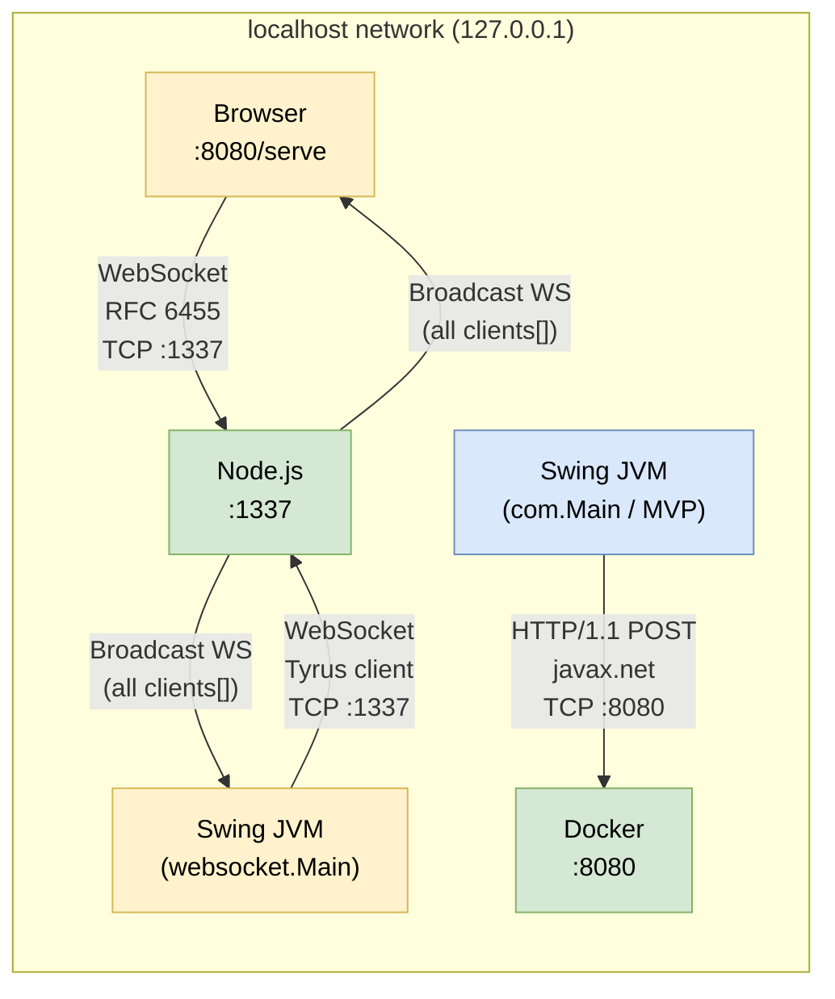
```mermaid
graph LR
    classDef client fill:#dae8fc,stroke:#6c8ebf,color:#000
    classDef server fill:#d5e8d4,stroke:#82b366,color:#000
    classDef ws fill:#fff2cc,stroke:#d6b656,color:#000

    subgraph NET["localhost network (127.0.0.1)"]
        B["Browser\n:8080/serve"]
        N["Node.js\n:1337"]
        S["Swing JVM\n(websocket.Main)"]
        M["Swing JVM\n(com.Main / MVP)"]
        D["Docker\n:8080"]
    end

    B -- "WebSocket\nRFC 6455\nTCP :1337" --> N
    S -- "WebSocket\nTyrus client\nTCP :1337" --> N
    M -- "HTTP/1.1 POST\njavax.net\nTCP :8080" --> D
    N -- "Broadcast WS\n(all clients[])" --> B
    N -- "Broadcast WS\n(all clients[])" --> S

    class B,M client
    class N,D server
    class B,S ws
```

### 7.3 Deployment Prerequisites and Startup Sequence

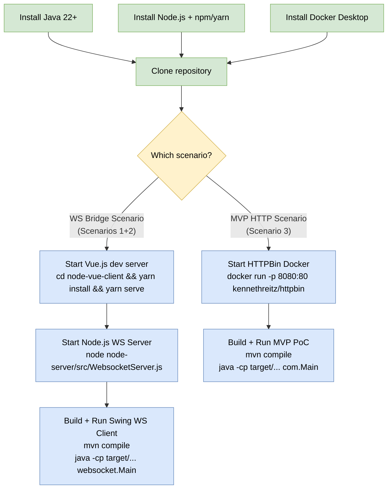
```mermaid
flowchart TD
    classDef prereq fill:#d5e8d4,stroke:#82b366,color:#000
    classDef step fill:#dae8fc,stroke:#6c8ebf,color:#000
    classDef decision fill:#fff2cc,stroke:#d6b656,color:#000
    classDef error fill:#f8cecc,stroke:#b85450,color:#000

    P1["Install Java 22+"]
    P2["Install Node.js + npm/yarn"]
    P3["Install Docker Desktop"]
    P4["Clone repository"]

    S1{"Which scenario?"}
    
    S2A["Start HTTPBin Docker<br/>docker run -p 8080:80 kennethreitz/httpbin"]
    S2B["Start Vue.js dev server<br/>cd node-vue-client && yarn install && yarn serve"]
    
    S3["Start Node.js WS Server<br/>node node-server/src/WebsocketServer.js"]
    
    S4A["Build + Run Swing WS Client<br/>mvn compile<br/>java -cp target/... websocket.Main"]
    S4B["Build + Run MVP PoC<br/>mvn compile<br/>java -cp target/... com.Main"]

    P1 --> P4
    P2 --> P4
    P3 --> P4
    P4 --> S1

    S1 -->|"WS Bridge Scenario\n(Scenarios 1+2)"| S2B
    S1 -->|"MVP HTTP Scenario\n(Scenario 3)"| S2A

    S2B --> S3
    S3 --> S4A

    S2A --> S4B

    class P1,P2,P3,P4 prereq
    class S2A,S2B,S3,S4A,S4B step
    class S1 decision
```

### 7.4 Environment Configuration

| Parameter | Value | Location | Configurable? |
|-----------|-------|----------|---------------|
| WS Server Port | `1337` | `WebsocketServer.js:4` | ❌ Hardcoded |
| Vue.js WS URL | `ws://localhost:1337/` | `Search.vue:132` | ❌ Hardcoded |
| Swing WS URL | `ws://localhost:1337/` | `websocket/Main.java:55` | ❌ Hardcoded |
| HTTPBin URL | `http://localhost:8080` | `HttpBinService.java:11` | ❌ Hardcoded |
| HTTPBin Docker Port | `8080:80` | Docker run command | ✅ CLI argument |
| Vue.js Dev Port | `8080` | Webpack defaults | ✅ `vue.config.js` |
| JVM Heap | Default JVM | N/A | ✅ JVM flags |
| Java Source/Target | `22` | `pom.xml:60-61` | ✅ `pom.xml` |

---

## 8. Cross-cutting Concepts

### 8.1 Communication Architecture

The system uses two distinct communication patterns:

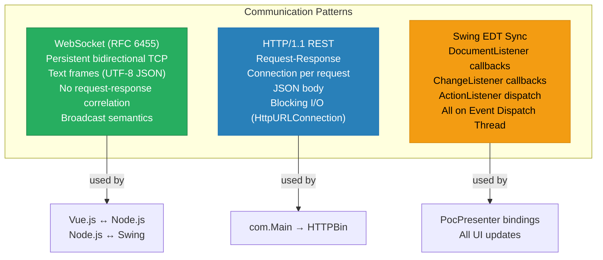
```mermaid
graph TB
    classDef ws fill:#27ae60,stroke:#1e8449,color:#fff
    classDef http fill:#2980b9,stroke:#1a6fb5,color:#fff
    classDef sync fill:#f39c12,stroke:#d68910,color:#000

    subgraph "Communication Patterns"
        WS_PATTERN["WebSocket (RFC 6455)<br/>Persistent bidirectional TCP<br/>Text frames (UTF-8 JSON)<br/>No request-response correlation<br/>Broadcast semantics"]
        HTTP_PATTERN["HTTP/1.1 REST<br/>Request-Response\nConnection per request\nJSON body\nBlocking I/O (HttpURLConnection)"]
        SWING_SYNC["Swing EDT Sync<br/>DocumentListener callbacks\nChangeListener callbacks\nActionListener dispatch\nAll on Event Dispatch Thread"]
    end

    WS_PATTERN --> |"used by"| WS_USAGE["Vue.js ↔ Node.js\nNode.js ↔ Swing"]
    HTTP_PATTERN --> |"used by"| HTTP_USAGE["com.Main → HTTPBin"]
    SWING_SYNC --> |"used by"| SWING_USAGE["PocPresenter bindings\nAll UI updates"]

    class WS_PATTERN ws
    class HTTP_PATTERN http
    class SWING_SYNC sync
```

#### WebSocket Message Flow Details

| Property | Value |
|----------|-------|
| **Frame type** | Text (UTF-8), never binary |
| **Message format** | JSON envelope: `{ "target": string, "content": any }` |
| **Target values** | `"textfield"` (person data) or `"textarea"` (plain text) |
| **Delivery guarantee** | Best-effort; no ACK; no replay on reconnect |
| **Ordering** | FIFO within single TCP connection |
| **Self-echo** | Yes — sender receives own broadcast (handled by ignoring in Vue) |

### 8.2 JSON Processing Strategy

Two different JSON strategies are used across the codebase:

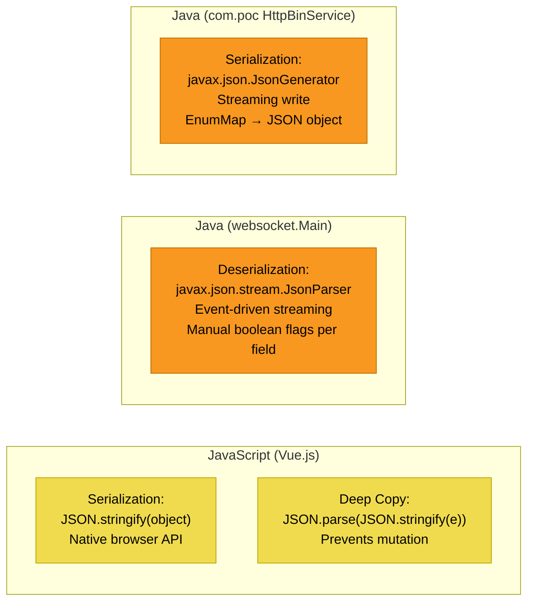
```mermaid
graph LR
    classDef js fill:#f0db4f,stroke:#c0a800,color:#000
    classDef java fill:#f89820,stroke:#c07000,color:#000

    subgraph "JavaScript (Vue.js)"
        JS_SER["Serialization:<br/>JSON.stringify(object)<br/>Native browser API"]
        JS_DEEP["Deep Copy:<br/>JSON.parse(JSON.stringify(e))<br/>Prevents mutation"]
    end

    subgraph "Java (websocket.Main)"
        JAVA_STREAM["Deserialization:<br/>javax.json.stream.JsonParser<br/>Event-driven streaming<br/>Manual boolean flags per field"]
    end

    subgraph "Java (com.poc HttpBinService)"
        JAVA_GEN["Serialization:<br/>javax.json.JsonGenerator<br/>Streaming write<br/>EnumMap → JSON object"]
    end

    class JS_SER,JS_DEEP js
    class JAVA_STREAM,JAVA_GEN java
```

**JsonParser Flag Pattern (websocket.Main):**

The manual JSON parsing in `websocket.Main` uses a **boolean flag pattern** for each expected key. This is verbose but has zero dependency overhead:

```java
boolean name = false;
// ...
while (jsonParser.hasNext()) {
    Event e = jsonParser.next();
    if (Event.KEY_NAME.equals(e) && "name".equals(jsonParser.getString())) {
        name = true;    // ← set flag when key found
    }
    if (name && Event.VALUE_STRING.equals(e)) {
        searchResult.name = jsonParser.getString();
        name = false;   // ← consume value, reset flag
    }
    // ... repeated 9 more times
}
```

**Limitation**: This pattern cannot handle nested objects. The `zahlungsempfaenger` nested object in the JSON is **not parsed** by `toSearchResult()` — only flat string fields are extracted. The IBAN/BIC values work because Vue.js flattens the zahlungsempfaenger into the top-level object before sending.

### 8.3 Concurrency Model

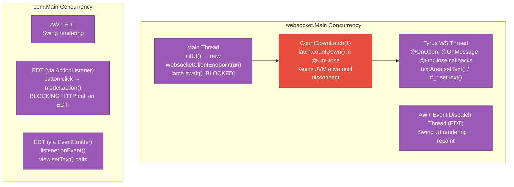
```mermaid
graph TB
    classDef thread fill:#9b59b6,stroke:#6c3483,color:#fff
    classDef latch fill:#e74c3c,stroke:#a93226,color:#fff

    subgraph "websocket.Main Concurrency"
        T1["Main Thread<br/>initUI() → new WebsocketClientEndpoint(uri)<br/>latch.await() [BLOCKED]"]
        T2["AWT Event Dispatch Thread (EDT)<br/>Swing UI rendering + repaint"]
        T3["Tyrus WS Thread<br/>@OnOpen, @OnMessage, @OnClose callbacks<br/>textArea.setText() / tf_*.setText()"]
        LATCH["CountDownLatch(1)<br/>latch.countDown() in @OnClose<br/>Keeps JVM alive until disconnect"]
        T1 --> LATCH
        LATCH --> T3
    end

    subgraph "com.Main Concurrency"
        T4["AWT EDT<br/>Swing rendering"]
        T5["EDT (via ActionListener)<br/>button click → model.action()<br/>BLOCKING HTTP call on EDT!"]
        T6["EDT (via EventEmitter)<br/>listener.onEvent()<br/>view.setText() calls"]
    end

    class T1,T4 thread
    class T2,T3,T5,T6 thread
    class LATCH latch
```

> ⚠️ **Critical Issue**: `model.action()` in `PocPresenter` is called from an `ActionListener` which runs on the **AWT Event Dispatch Thread (EDT)**. The HTTP call in `HttpBinService.post()` uses blocking `HttpURLConnection`, which will **freeze the Swing UI** for the duration of the HTTP request. This is a violation of Swing threading rules. In production, this must be moved to a background thread using `SwingWorker` or `CompletableFuture`.

### 8.4 Error Handling Strategy

Current error handling is minimal and consistent with PoC status:

| Component | Error Type | Current Handling | Production Recommendation |
|-----------|-----------|-----------------|--------------------------|
| Vue.js WebSocket | Connection refused | Silent failure; no retry | Add `socket.onerror`, `socket.onclose` with reconnect logic |
| Vue.js WebSocket | Server unavailable | `sendMessage()` throws uncaught exception | Try-catch around `socket.send()` |
| Node.js WS Server | Invalid JSON | Passes through unchanged | Add `JSON.parse` validation |
| Node.js WS Server | Client disconnect | `splice(index, 1)` removes from array | Consider index drift if multiple clients disconnect simultaneously |
| websocket.Main | DeploymentException | Wrapped in `RuntimeException` in constructor | Add retry with backoff |
| websocket.Main | Invalid JSON message | JsonParser fails silently | Add try-catch in `onMessage` |
| com.Main HttpBinService | HTTP error codes | ResponseCode checked but not validated | Add non-200 status handling |
| com.Main HttpBinService | Empty response | `eventEmitter.emit("Failed operation")` | More specific error categorization |
| com.Main PocModel | Null field value | `getField().toString()` → NullPointerException | Null-check before toString() |
| com.Main PocModel | Boolean cast | `(ValueModel<Boolean>)` unchecked cast | Use typed method or Optional |

### 8.5 UI/UX Patterns

#### Vue.js UI Patterns

| Pattern | Implementation | Vue.js Feature |
|---------|---------------|----------------|
| **Two-way data binding** | All form inputs bound to `formdata.*` | `v-model` directive |
| **Computed filtering** | `searchPerson()` filters in-memory array | Method-based (not computed property) |
| **Reactive list rendering** | Search results and Zahlungsempfänger tables | `v-for` with `:key` |
| **Conditional styling** | Selected row highlighting | `:class="{'highlight': ...}"` |
| **Event handling** | Button clicks, row clicks | `v-on:click` / `@click` |
| **Prop passing** | `content_textarea` passed from App to Search | `props: { content_textarea: String }` |
| **Lifecycle hook** | WebSocket connection on mount | `mounted: function() { this.connect(); }` |
| **Reactive watch** | Textarea mirror to WebSocket | `watch: { internal_content_textarea: fn }` |

#### Swing UI Patterns

| Pattern | Implementation |
|---------|---------------|
| **GridBagLayout** | Both `PocView` and `websocket.Main.initUI()` use `GridBagLayout` with `GridBagConstraints` |
| **Button group** | `ButtonGroup` ensures mutual exclusion of Weiblich/Männlich/Divers radio buttons |
| **Passive View** | `PocView` exposes all widgets as `protected` fields; presenter controls all logic |
| **DocumentListener** | Used in `PocPresenter` for real-time text field synchronization to model |
| **ChangeListener** | Used for radio button state tracking in `PocPresenter` |
| **ActionListener** | Button click → `model.action()` invocation |

### 8.6 Domain Model

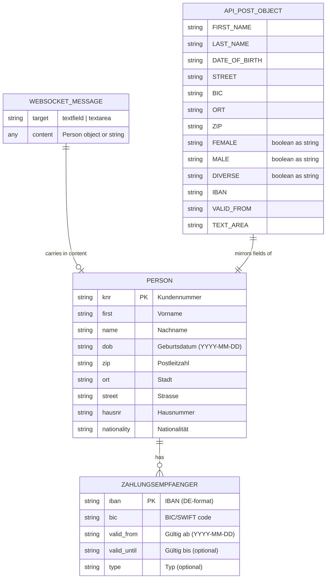
```mermaid
erDiagram
    PERSON {
        string knr PK "Kundennummer"
        string first "Vorname"
        string name "Nachname"
        string dob "Geburtsdatum (YYYY-MM-DD)"
        string zip "Postleitzahl"
        string ort "Stadt"
        string street "Strasse"
        string hausnr "Hausnummer"
        string nationality "Nationalität"
    }

    ZAHLUNGSEMPFAENGER {
        string iban PK "IBAN (DE-format)"
        string bic "BIC/SWIFT code"
        string valid_from "Gültig ab (YYYY-MM-DD)"
        string valid_until "Gültig bis (optional)"
        string type "Typ (optional)"
    }

    WEBSOCKET_MESSAGE {
        string target "textfield | textarea"
        any content "Person object or string"
    }

    API_POST_OBJECT {
        string FIRST_NAME
        string LAST_NAME
        string DATE_OF_BIRTH
        string STREET
        string BIC
        string ORT
        string ZIP
        string FEMALE "boolean as string"
        string MALE "boolean as string"
        string DIVERSE "boolean as string"
        string IBAN
        string VALID_FROM
        string TEXT_AREA
    }

    PERSON ||--o{ ZAHLUNGSEMPFAENGER : "has"
    WEBSOCKET_MESSAGE ||--o| PERSON : "carries in content"
    API_POST_OBJECT ||--|| PERSON : "mirrors fields of"
```

**Domain Term Mapping (Vue.js ↔ Java ↔ API):**

| Vue.js field | Java field | API enum | German label |
|-------------|-----------|----------|-------------|
| `first` | `searchResult.first` / `firstName` | `FIRST_NAME` | Vorname |
| `name` | `searchResult.name` / `name` | `LAST_NAME` | Name |
| `dob` | `searchResult.dob` / `dateOfBirth` | `DATE_OF_BIRTH` | Geburtsdatum |
| `zip` | `searchResult.zip` / `zip` | `ZIP` | PLZ |
| `ort` | `searchResult.ort` / `ort` | `ORT` | Ort |
| `street` | `searchResult.street` / `street` | `STREET` | Strasse |
| `hausnr` | `searchResult.hausnr` | N/A | Hausnummer |
| `iban` (ze) | `searchResult.ze_iban` / `iban` | `IBAN` | IBAN |
| `bic` (ze) | `searchResult.ze_bic` / `bic` | `BIC` | BIC |
| `valid_from` (ze) | `searchResult.ze_valid_from` / `validFrom` | `VALID_FROM` | Gültig ab |

### 8.7 Security Concepts (Current PoC State)

> ⚠️ **The current PoC has NO security measures.** The following documents what is missing and must be addressed before any production deployment.

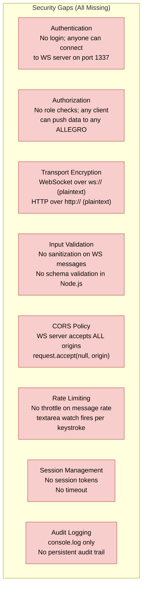
```mermaid
graph TB
    classDef missing fill:#f8cecc,stroke:#b85450,color:#000
    classDef present fill:#d5e8d4,stroke:#82b366,color:#000

    subgraph "Security Gaps (All Missing)"
        AUTH["Authentication<br/>No login; anyone can connect<br/>to WS server on port 1337"]
        AUTHZ["Authorization<br/>No role checks; any client<br/>can push data to any ALLEGRO"]
        TLS["Transport Encryption<br/>WebSocket over ws:// (plaintext)<br/>HTTP over http:// (plaintext)"]
        INPUT["Input Validation<br/>No sanitization on WS messages<br/>No schema validation in Node.js"]
        CORS["CORS Policy<br/>WS server accepts ALL origins<br/>request.accept(null, origin)"]
        RATE["Rate Limiting<br/>No throttle on message rate<br/>textarea watch fires per keystroke"]
        SESSION["Session Management<br/>No session tokens<br/>No timeout"]
        AUDIT["Audit Logging<br/>console.log only<br/>No persistent audit trail"]
    end

    class AUTH,AUTHZ,TLS,INPUT,CORS,RATE,SESSION,AUDIT missing
```

**Minimum Security Requirements for Production:**

| Requirement | Implementation Approach |
|-------------|------------------------|
| Authentication | WebSocket subprotocol with JWT; OAuth2 integration |
| Transport Security | TLS (`wss://`, `https://`); certificate management |
| Authorization | Server-side message filtering; client identity verification |
| Input Validation | JSON Schema validation in Node.js relay |
| CORS | Whitelist specific allowed origins |
| Rate Limiting | Token bucket per client connection |

---

## 9. Architecture Decisions

### ADR-001: WebSocket Relay Architecture

**Status**: Accepted  
**Date**: 2019-2023 (initial PoC)  
**Deciders**: PoC team

#### Context

ALLEGRO is a complex Java Swing desktop application with no public API, no REST endpoints, and significant business logic embedded in the UI layer. Full rewriting would take years and carry extreme risk. The team needed a way to demonstrate that a modern web UI could interact with ALLEGRO without modifying its core.

#### Decision

Implement a **three-component bridge**:
1. Modern Vue.js web UI for search and data selection
2. Node.js WebSocket server as a pure broadcast relay
3. Java WebSocket client embedded in (or alongside) the Swing app, receiving messages and populating UI fields

#### Consequences

| Positive | Negative |
|---------|---------|
| Zero changes to ALLEGRO's business logic | ALLEGRO Swing app must be started separately alongside the relay |
| Incrementally adoptable — add more fields as needed | One-way push only (web → Swing); no readback from ALLEGRO |
| Proves modernization feasibility with minimal investment | Broadcast means all connected ALLEGRO instances receive every message |
| Standard WebSocket protocol; future-proof | No authentication; vulnerable to unauthorized field population |
| Works across any platform where both components run | Port 1337 firewall configuration required |

#### Alternatives Considered

| Alternative | Why Rejected |
|-------------|-------------|
| **Shared Database** | ALLEGRO's database schema may be proprietary; DB schema changes risky |
| **ALLEGRO REST API** | Does not exist; building one requires deep ALLEGRO modification |
| **Screen Scraping / RPA** | Brittle; breaks with UI changes; no semantic understanding |
| **Full Rewrite** | Multi-year effort; extreme business risk during transition |
| **Java Accessibility API** | Platform-specific; fragile; maintenance nightmare |

---

### ADR-002: MVP Pattern for Swing Refactoring

**Status**: Accepted  
**Date**: Post-initial PoC  
**Deciders**: Development team

#### Context

The `websocket.Main` class demonstrates the integration concept but is a 457-line monolith with static fields, mixed UI/business logic, and no testability. A second PoC component was needed to show how ALLEGRO's Swing code could be **gradually refactored** without a rewrite.

#### Decision

Implement a parallel demonstration using the **Model-View-Presenter (MVP)** pattern with:
- `PocView`: Pure passive view (no logic)
- `PocPresenter`: All user interaction handling via listener bindings
- `PocModel`: State management and service calls
- `EventEmitter`: Loose coupling for async responses

#### Rationale

MVP was chosen over MVC because:
1. Swing's event dispatch mechanism naturally fits presenter-driven updates
2. The **Passive View** variant allows unit testing the presenter without a Swing display
3. MVP is simpler to understand for Java developers familiar with Swing
4. No external framework required (pure Java)

#### Consequences

| Positive | Negative |
|---------|---------|
| Clear separation: `PocView` has zero business logic | `PocView` exposes all fields as `protected` — leaks internal structure |
| `PocPresenter` testable without display | `ViewData.java` is an empty stub — incomplete design |
| `EventEmitter` decouples HTTP response from UI update | `EventEmitter` uses `String` payload — no type safety |
| New fields require only 3 additions | `PocModel.action()` unsafe cast: `(ValueModel<Boolean>)` |
| `PocModel` single responsibility: state + HTTP | Blocking HTTP on EDT (see §8.3) |

---

### ADR-003: In-Memory Mock Data

**Status**: Accepted (for PoC only)  
**Date**: Initial PoC  
**Deciders**: PoC team

#### Context

The PoC needs realistic-looking person data to demonstrate the search and transfer workflow without connecting to real ALLEGRO databases (which contain sensitive citizen PII and require access credentials, VPN, etc.).

#### Decision

Embed **5 hardcoded person records** with realistic German names, addresses, and IBAN numbers directly in `Search.vue`'s `data()` function as the `search_space` array.

```javascript
search_space: [
  { first:'Hans', name:'Mayer', dob:'1981-01-08', zip:'95183', ort:'Trogen', ... },
  { first:'Linda', name:'Reitmayr', ... },
  { first:'Karl', name:'May', ... },
  { first:'Jens', name:'Mueller', ... },
  { first:'Steffi', name:'Ruckmueller', ... }
]
```

Each person has 2-3 Zahlungsempfänger entries with real IBAN format but non-real account numbers.

#### Consequences

| Positive | Negative |
|---------|---------|
| Zero backend dependencies for PoC demo | Not scalable; adding persons requires code changes |
| Runs completely offline | Search results always the same; no database queries |
| No GDPR concerns with fake data | Does not test performance with real data volumes |
| Immediate demo capability | OR-logic search not representative of real ALLEGRO search |

---

### ADR-004: Technology Stack Choices

**Status**: Accepted  
**Date**: Initial PoC

#### Frontend: Vue.js 2.6 over React/Angular

| Factor | Vue.js 2.6 | React | Angular |
|--------|-----------|-------|---------|
| Bundle size | Small (~33KB gzipped) | Medium | Large |
| Learning curve | Low | Medium | High |
| Template syntax | HTML-like (approx ALLEGRO HTML5) | JSX | TypeScript |
| State management | Reactive data() | Redux complexity | RxJS |
| Decision | ✅ **Selected** | ❌ | ❌ |

#### Relay Server: Node.js over Spring Boot / Netty

The relay server has exactly **one function**: receive a message and send it to all clients. Node.js with the `websocket` package achieves this in **68 lines of code**. Spring Boot WebSocket would require ~10 files, Maven dependencies, and application context overhead.

#### Java WebSocket: Tyrus over Java 11+ HttpClient

At the time of initial development, Java 11's built-in WebSocket client was newer and less proven. Tyrus 1.15 implements JSR-356 (the Java EE standard) and works as a standalone client without requiring a full application server.

#### JSON: javax.json over Jackson/Gson

Adding Jackson (~2MB) or Gson (~250KB) would be justified for production. For a PoC with a simple, known JSON structure, javax.json streaming API adds zero additional dependencies (it was already required for other purposes) and provides acceptable functionality.

---

### ADR-005: CountDownLatch for JVM Lifecycle Management

**Status**: Accepted  
**Date**: Initial PoC

#### Context

A Java application's `main()` method exits after the last non-daemon thread finishes. The Tyrus WebSocket client runs on daemon threads. Without a mechanism to keep the main thread alive, the JVM exits immediately after connecting.

#### Decision

Use `CountDownLatch(1)` in `main()`:
- `latch.await()` blocks the main thread
- `latch.countDown()` is called in `@OnClose` when the WebSocket disconnects
- This keeps the JVM alive for the lifetime of the WebSocket connection

#### Alternative

`Thread.sleep(Long.MAX_VALUE)` or a busy loop — rejected for being inelegant and non-interruptible. `CountDownLatch` cleanly ties JVM lifetime to connection lifetime.

---

## 10. Quality Requirements

### 10.1 Quality Tree

```mermaid
graph TB
    classDef root fill:#2c3e50,stroke:#1a252f,color:#fff
    classDef l1 fill:#3498db,stroke:#2980b9,color:#fff
    classDef l2 fill:#27ae60,stroke:#1e8449,color:#fff
    classDef l3_good fill:#d5e8d4,stroke:#82b366,color:#000
    classDef l3_bad fill:#f8cecc,stroke:#b85450,color:#000
    classDef l3_mid fill:#fff2cc,stroke:#d6b656,color:#000

    ROOT["System Quality"]

    ROOT --> FUNC["Functional Suitability"]
    ROOT --> PERF["Performance Efficiency"]
    ROOT --> MAINT["Maintainability"]
    ROOT --> COMPAT["Compatibility"]
    ROOT --> SECURE["Security"]
    ROOT --> RELIABLE["Reliability"]
    ROOT --> USABLE["Usability"]

    FUNC --> F1["✅ WS Bridge works<br/>field population verified"]
    FUNC --> F2["✅ OR-search filters correctly<br/>case-insensitive indexOf"]
    FUNC --> F3["✅ MVP form submits and resets<br/>EventEmitter response handling"]
    FUNC --> F4["❌ No real data source<br/>mock only"]
    FUNC --> F5["❌ No ALLEGRO write-back<br/>read-only from WS"]

    PERF --> P1["⚠️ No debounce on textarea<br/>message per keystroke"]
    PERF --> P2["✅ Local WS < 5ms latency<br/>imperceptible to user"]
    PERF --> P3["❌ Blocking HTTP on EDT<br/>UI freeze on submit"]
    PERF --> P4["⚠️ O(n) search on all fields<br/>acceptable for 5 records"]

    MAINT --> M1["✅ MVP pattern in com.poc<br/>clear separation of concerns"]
    MAINT --> M2["✅ OpenAPI spec in api.yml<br/>data contract documented"]
    MAINT --> M3["❌ websocket.Main is a monolith<br/>457 lines, static state"]
    MAINT --> M4["❌ No unit tests anywhere<br/>0% test coverage"]
    MAINT --> M5["❌ ViewData.java is empty stub"]

    COMPAT --> C1["❌ Vue.js 2.6 EOL Dec 2023"]
    COMPAT --> C2["✅ Java 22 LTS-aligned"]
    COMPAT --> C3["⚠️ WebSocket browser API<br/>IE11 not supported"]
    COMPAT --> C4["✅ Standard RFC 6455 WS protocol"]

    SECURE --> S1["❌ No authentication on WS"]
    SECURE --> S2["❌ No TLS (plaintext ws://)"]
    SECURE --> S3["❌ Any origin accepted"]
    SECURE --> S4["❌ No input validation"]

    RELIABLE --> R1["❌ No WS reconnect in Vue.js"]
    RELIABLE --> R2["❌ No error handling in onMessage"]
    RELIABLE --> R3["✅ CountDownLatch keeps JVM alive"]
    RELIABLE --> R4["⚠️ Broadcast self-echo handled by omission"]

    USABLE --> U1["✅ German UI labels match domain"]
    USABLE --> U2["✅ Table row highlighting for selection"]
    USABLE --> U3["⚠️ No loading indicators"]
    USABLE --> U4["❌ No feedback on WS disconnect"]

    class ROOT root
    class FUNC,PERF,MAINT,COMPAT,SECURE,RELIABLE,USABLE l1
    class F1,F2,F3,P2,M1,M2,C2,C4,R3,U1,U2 l3_good
    class F4,F5,P3,M3,M4,M5,C1,S1,S2,S3,S4,R1,R2,U4 l3_bad
    class P1,P4,C3,R4,U3 l3_mid
```

### 10.2 Quality Scenarios

| ID | Quality Attribute | Scenario | Stimulus | Expected Response | Actual Status |
|----|-----------------|----------|---------|------------------|---------------|
| QS-01 | **Correctness** | User selects Hans Mayer with IBAN DE27... and clicks transfer | Click "Nach ALLEGRO übernehmen" | All 10 ALLEGRO fields populated correctly within 500ms | ✅ Works |
| QS-02 | **Responsiveness** | User types 100 characters in textarea | Keystroke events | Each character mirrored to Swing within 100ms | ✅ Works (local); ⚠️ 100 WS messages sent |
| QS-03 | **Resilience** | Node.js server crashes during session | WS connection dropped | Vue.js shows error; auto-reconnects within 5s | ❌ Silent failure; no reconnect |
| QS-04 | **Concurrency** | 3 ALLEGRO instances open; 1 Vue.js client | User sends data | All 3 ALLEGRO instances receive the same data | ✅ Works (broadcast design) |
| QS-05 | **Extensibility** | Add "Nationality" field to MVP PoC | Developer task | Add 1 enum value + 1 JTextField + 1 bind() call | ✅ Possible by design |
| QS-06 | **Load** | 50 concurrent case workers use the system | 50 browser WebSocket connections | All receive broadcasts; no data loss | ❌ Not tested; clients[] array not thread-safe |
| QS-07 | **Security** | Unauthorized user connects to port 1337 | WebSocket connect | Connection rejected; authentication required | ❌ Connection accepted |
| QS-08 | **Startup time** | Developer starts all components | 3-step startup | All components ready within 30 seconds | ✅ ~15 seconds on modern hardware |
| QS-09 | **Field accuracy** | Person with umlauts (Müller, Köln) transferred | WS message with UTF-8 umlauts | Fields correctly display German special characters | ✅ UTF-8 throughout |
| QS-10 | **EDT compliance** | Form submitted via "Anordnen" button | HTTP request on EDT | UI remains responsive during request | ❌ UI freezes during HTTP call |

### 10.3 Code Metrics Summary

| Metric | websocket.Main | com.poc package | Search.vue | WS Server |
|--------|---------------|----------------|-----------|----------|
| Lines of code | 457 | ~350 | 252 | 68 |
| Cyclomatic complexity | High (many switch/if) | Low-Medium | Medium | Low |
| Test coverage | 0% | 0% | 0% | 0% |
| External dependencies | Tyrus, javax.json | javax.json | Vue.js | websocket npm |
| Static fields/state | 14 static fields | 0 (proper OOP) | N/A (reactive) | 2 global vars |
| Inner classes | 3 | 0 | N/A | 0 |
| Design pattern | None (procedural) | MVP + Observer | Component | None |

---

## 11. Risks and Technical Debt

### 11.1 Risk Register

```mermaid
quadrantChart
    title Risk Matrix (Impact vs. Likelihood)
    x-axis Low Likelihood --> High Likelihood
    y-axis Low Impact --> High Impact
    quadrant-1 Critical - Mitigate Now
    quadrant-2 Monitor - Plan Mitigation
    quadrant-3 Accept - Low Priority
    quadrant-4 Mitigate - Process Controls

    RISK_AUTH: [0.9, 0.95]
    RISK_TLS: [0.85, 0.90]
    RISK_VUE_EOL: [0.75, 0.70]
    RISK_EDT_BLOCK: [0.80, 0.60]
    RISK_BROADCAST: [0.70, 0.55]
    RISK_TYRUS: [0.40, 0.50]
    RISK_MOCK: [0.95, 0.40]
    RISK_JSON: [0.60, 0.45]
    RISK_TESTS: [0.90, 0.35]
    RISK_RECONNECT: [0.65, 0.30]
```

**Risk Register Table:**

| ID | Risk | Impact | Likelihood | Score | Mitigation |
|----|------|--------|-----------|-------|-----------|
| R-01 | **No authentication on WS port 1337** | Critical — unauthorized data injection into ALLEGRO | Very High | 🔴 Critical | Add WS auth (JWT/OAuth2) before any production use |
| R-02 | **Plaintext WebSocket (ws://)** | High — citizen data transmitted unencrypted | High | 🔴 Critical | Enable TLS (`wss://`); obtain certificates |
| R-03 | **Vue.js 2.6 reached End of Life** | Medium — security patches no longer provided | High | 🟠 High | Migrate to Vue.js 3 or another maintained framework |
| R-04 | **Blocking HTTP call on Swing EDT** | Medium — UI freeze degrades UX; may appear crashed | High | 🟠 High | Wrap HTTP call in `SwingWorker` or `CompletableFuture` |
| R-05 | **Broadcast sends data to all ALLEGRO instances** | Medium — wrong case worker's screen populated | High | 🟠 High | Add client identity; route messages to specific clients |
| R-06 | **Tyrus 1.15 is outdated (2018)** | Low-Medium — potential CVEs; no active maintenance | Medium | 🟡 Medium | Evaluate Java 11+ built-in WS client or newer Tyrus |
| R-07 | **Mock data only; no real backend** | High — PoC cannot be promoted to production as-is | Very High | 🟡 Medium (by design) | Implement real data source when PoC approved |
| R-08 | **Manual JSON parsing** | Medium — bugs on new fields; no schema validation | Medium | 🟡 Medium | Switch to Jackson/Gson with POJO mapping |
| R-09 | **0% test coverage** | High — regressions undetected | Very High | 🟡 Medium | Add unit tests for Presenter, Model, searchPerson logic |
| R-10 | **No WS reconnect logic in Vue.js** | Low — user must refresh browser on disconnect | Medium | 🟢 Low | Add `socket.onclose` reconnect with exponential backoff |
| R-11 | **Port 8080 conflict (Vue vs HTTPBin)** | Low — developer confusion during setup | High | 🟢 Low | Document clearly; use different ports (e.g., 8081 for HTTPBin) |
| R-12 | **Self-echo of WS broadcast** | Low — silently discarded by Vue.js (no onmessage handler) | High | 🟢 Low | Add echo-prevention (sender ID in message) |

### 11.2 Technical Debt Backlog

#### High Priority (Must Fix Before Production)

| TD-ID | Item | Location | Effort | Category |
|-------|------|----------|--------|---------|
| TD-01 | Add WebSocket authentication (JWT) | Node.js + Vue.js + Swing | Large | Security |
| TD-02 | Enable TLS (wss:// + https://) | All components | Medium | Security |
| TD-03 | Replace blocking HTTP with `SwingWorker` | `PocPresenter.java` line 41-48 | Small | Correctness |
| TD-04 | Add WS reconnection logic to Vue.js | `Search.vue:connect()` | Small | Reliability |
| TD-05 | Implement real person data source | `Search.vue:search_space` | Large | Functionality |
| TD-06 | Add client routing (not broadcast to all) | `WebsocketServer.js` | Medium | Correctness |

#### Medium Priority (Quality Improvements)

| TD-ID | Item | Location | Effort | Category |
|-------|------|----------|--------|---------|
| TD-07 | Add textarea debounce (300ms) | `Search.vue:watch` | Small | Performance |
| TD-08 | Replace manual JSON parsing with Jackson | `websocket/Main.java:toSearchResult()` | Medium | Maintainability |
| TD-09 | Migrate Vue.js 2 → Vue.js 3 | `node-vue-client/` | Large | Maintainability |
| TD-10 | Fix null-safety in `PocModel.action()` | `PocModel.java:37-40` | Small | Correctness |
| TD-11 | Fix unsafe Boolean cast in `PocPresenter` | `PocPresenter.java:88` | Small | Correctness |
| TD-12 | Externalize hardcoded URLs to config | All Java + Vue files | Small | Operability |
| TD-13 | Implement `ViewData.java` (currently empty) | `com/poc/model/ViewData.java` | Medium | Design |
| TD-14 | Integrate two Java entry points (`websocket.Main` + `com.Main`) | Architecture level | Large | Maintainability |

#### Low Priority (Nice to Have)

| TD-ID | Item | Location | Effort | Category |
|-------|------|----------|--------|---------|
| TD-15 | Add unit tests (JUnit 5 + Mockito) | All Java packages | Large | Testability |
| TD-16 | Add Vue.js component tests (Jest) | `node-vue-client/` | Medium | Testability |
| TD-17 | Add input validation on WS messages | `WebsocketServer.js` | Small | Robustness |
| TD-18 | Remove dead `messages[]` array | `WebsocketServer.js:6` | Trivial | Cleanliness |
| TD-19 | Fix duplicate `panel.add(textArea)` call | `websocket/Main.java:221-222` | Trivial | Correctness |
| TD-20 | Add loading indicator for HTTP submit | `PocView.java` | Small | UX |
| TD-21 | Add error feedback for WS disconnect | `Search.vue` | Small | UX |
| TD-22 | Move CSS from inline to separate file | `Search.vue:<style>` | Small | Maintainability |

### 11.3 Modernization Roadmap

Based on the PoC findings, the recommended path to production-ready modernization:

```mermaid
gantt
    title Modernization Roadmap (Suggested)
    dateFormat  YYYY-QQ
    axisFormat  %Y Q%q

    section Phase 1: Security Hardening
    Add TLS (wss:// + https://)           :crit, 2025-Q1, 2025-Q1
    Add JWT authentication                 :crit, 2025-Q1, 2025-Q2
    Add client identity routing            :crit, 2025-Q2, 2025-Q2

    section Phase 2: Reliability
    WS reconnect logic                     :2025-Q1, 2025-Q1
    SwingWorker for HTTP calls             :2025-Q1, 2025-Q1
    Debounce textarea watch                :2025-Q1, 2025-Q1
    Error handling + logging               :2025-Q2, 2025-Q2

    section Phase 3: Data Integration
    Real ALLEGRO data source API           :2025-Q2, 2025-Q3
    Replace mock search_space              :2025-Q3, 2025-Q3
    Person search pagination               :2025-Q3, 2025-Q3

    section Phase 4: Code Quality
    Add unit tests (80% coverage target)   :2025-Q2, 2025-Q3
    Vue.js 2 → Vue.js 3 migration          :2025-Q3, 2025-Q4
    Jackson JSON migration                 :2025-Q3, 2025-Q3
    Externalize configuration              :2025-Q2, 2025-Q2

    section Phase 5: Integration
    Merge websocket.Main + com.Main        :2025-Q4, 2025-Q4
    MVP pattern for full ALLEGRO UI        :2025-Q4, 2026-Q1
    CI/CD pipeline setup                   :2025-Q4, 2025-Q4
```

---

## 12. Glossary

### 12.1 Domain Terms (German / English)

| German Term | English Translation | Definition in Context |
|-------------|--------------------|-----------------------|
| **ALLEGRO** | ALLEGRO | Proprietary Java Swing desktop application used in German social insurance offices (Jobcenter, ARGE) for case management and benefit disbursements |
| **Sachbearbeiter** | Case Worker / Clerk | The primary end user who processes citizen cases in ALLEGRO |
| **Versicherte/r** | Insured Person / Beneficiary | A citizen whose case is managed in ALLEGRO |
| **Kundennummer (KNR)** | Customer/Client Number | Unique identifier for a person in the ALLEGRO system; shown as `knr` in data model |
| **Zahlungsempfänger** | Payment Recipient / Payee | A bank account entry (IBAN + BIC) registered for a person to receive benefit payments |
| **Gültig ab** | Valid from | Start date of a Zahlungsempfänger's validity period |
| **Gültig bis** | Valid until | End date of a Zahlungsempfänger's validity period (optional) |
| **Vorname** | First name | Person's given name |
| **Name / Nachname** | Last name / Surname | Person's family name |
| **Geburtsdatum** | Date of birth | Format: YYYY-MM-DD |
| **PLZ (Postleitzahl)** | ZIP / Postal code | German postal code (5 digits) |
| **Ort** | City / Town | Municipality name |
| **Strasse** | Street | Street name (without house number) |
| **Hausnummer** | House number | Building number on the street |
| **Geschlecht** | Gender | Weiblich (female), Männlich (male), Divers (non-binary/diverse) |
| **Weiblich** | Female | Female gender selection |
| **Männlich** | Male | Male gender selection |
| **Divers** | Diverse / Non-binary | Third gender option per German civil law (since 2018) |
| **Anordnen** | Order / Arrange / Submit | Button label in MVP PoC meaning "submit/process this data" |
| **Suchen** | Search | Button label meaning "search" |
| **Nach ALLEGRO übernehmen** | Transfer to ALLEGRO | Button label meaning "take this data over to ALLEGRO" |
| **Kundennummer (KNR)** | Customer number | Person's unique ID |
| **RV-Nummer** | Pension insurance number | Rentenversicherungsnummer — social security number equivalent |
| **IBAN** | IBAN | International Bank Account Number (DE-format in this system) |
| **BIC** | BIC | Bank Identifier Code / SWIFT code |
| **Betriebsbez.** | Business designation | Betriebsbezeichnung — employer/company name |
| **Postfach** | PO Box | Postfach — postal box address alternative |
| **BG-Nummer** | Benefit community number | Bedarfsgemeinschaftsnummer — household/benefit group identifier |
| **Vorsatzwort** | Name prefix | Nobility particle or prefix (e.g., "von", "van") |
| **Träger-Nr.** | Carrier number | Träger-Nummer der gemeinsamen Einrichtung — agency/office ID |

### 12.2 Technical Terms

| Term | Definition |
|------|-----------|
| **WebSocket (RFC 6455)** | Bidirectional, full-duplex communication protocol over a single TCP connection; initiated via HTTP Upgrade handshake |
| **JSR-356** | Java Specification Request 356: Java API for WebSocket; defines `@ClientEndpoint`, `@OnOpen`, `@OnMessage`, `@OnClose` annotations |
| **Tyrus** | GlassFish project; reference implementation of JSR-356; used here as `tyrus-standalone-client` (no app server required) |
| **javax.websocket** | Java package namespace for JSR-356 WebSocket API (pre-Jakarta EE 9); not compatible with `jakarta.websocket` |
| **javax.json** | Java package for JSON processing (JSR-374); includes streaming `JsonParser` and `JsonGenerator` |
| **JsonParser** | Streaming JSON reader from `javax.json.stream`; event-driven (KEY_NAME, VALUE_STRING, etc.); low memory overhead |
| **JsonGenerator** | Streaming JSON writer from `javax.json.stream`; writes JSON tokens incrementally to an `OutputStream` |
| **MVP (Model-View-Presenter)** | UI architectural pattern; Presenter mediates between passive View and Model; improves testability |
| **Passive View** | MVP variant where View has no logic; all interaction handled by Presenter; View exposes raw widgets |
| **EventEmitter** | Observer/Publisher-Subscriber pattern implementation; allows Model to notify Presenter without direct coupling |
| **CountDownLatch** | `java.util.concurrent.CountDownLatch`; synchronization aid that allows one thread to wait until count reaches zero |
| **AWT EDT** | Abstract Window Toolkit Event Dispatch Thread; the single thread on which all Swing UI operations must execute |
| **SwingWorker** | Java class for executing background tasks and publishing results to the EDT safely |
| **DocumentListener** | Swing interface for receiving notification of text document changes; fires `insertUpdate`, `removeUpdate`, `changedUpdate` |
| **ChangeListener** | Swing interface for state change notifications; used on `JRadioButton` and `JSlider` |
| **ActionListener** | Java AWT interface for receiving action events (button clicks, menu selections) |
| **GridBagLayout** | Flexible Swing layout manager; positions components in a grid with `GridBagConstraints` |
| **ButtonGroup** | Swing class that makes a set of `AbstractButton` instances mutually exclusive |
| **Vue.js SFC** | Single File Component (.vue); contains `<template>`, `<script>`, `<style>` in one file |
| **v-model** | Vue.js directive for two-way data binding between form inputs and component data |
| **v-for** | Vue.js directive for rendering a list of items from an array |
| **v-on:click / @click** | Vue.js directive for binding click event handlers |
| **:class** | Vue.js directive for dynamic CSS class binding |
| **Vue watch** | Vue.js `watch` option for observing and reacting to data changes |
| **mounted()** | Vue.js lifecycle hook called when the component is inserted into the DOM |
| **Webpack** | JavaScript module bundler; used by Vue CLI to bundle and serve the SPA |
| **EnumMap** | Java `Map` implementation using an `enum` as keys; provides O(1) lookup; used in `PocModel` |
| **ValueModel\<T\>** | Generic wrapper class holding a single typed value field; enables homogeneous storage in the EnumMap |
| **HttpURLConnection** | Legacy Java class in `java.net` for HTTP communication; blocking I/O; replaced by `java.net.http.HttpClient` in Java 11+ |
| **Broadcast relay** | Network pattern where a server forwards all received messages to all connected clients without filtering or routing |
| **PoC (Proof of Concept)** | A prototype implementation that demonstrates technical feasibility without production quality or completeness |
| **Strangler Fig Pattern** | Modernization strategy where new functionality gradually replaces legacy system components without a "big bang" rewrite |
| **OR-logic search** | Search algorithm where a result is returned if it matches **any** of the provided criteria (union semantics) |
| **Self-echo** | The behavior where a WebSocket client receives the message it sent, because the server broadcasts to all clients including the sender |
| **HTTPBin** | Open-source HTTP echo service; accepts any HTTP request and returns information about it; containerized via Docker |
| **Deep copy** | Creating a new object with all nested references copied (not shared); achieved in JS with `JSON.parse(JSON.stringify(obj))` |
| **Debounce** | Technique to delay execution of a function until a specified quiet time has elapsed; prevents excessive triggering |
| **JWT** | JSON Web Token; compact, URL-safe means of representing claims between two parties; used for stateless authentication |
| **TLS** | Transport Layer Security; cryptographic protocol providing communications security over a network; replaces SSL |
| **CORS** | Cross-Origin Resource Sharing; HTTP mechanism allowing or restricting resources based on the requesting origin |
| **GDPR / DSGVO** | General Data Protection Regulation (EU); governs processing of personal data; critical for citizen data in public administration |

---

## Appendix A: File Structure Reference

```
webscoket_swing/
├── api.yml                          # OpenAPI 3.0 specification for POST API
├── pom.xml                          # Maven build descriptor (Java 22, Tyrus, javax.json)
├── websocket_swing.iml              # IntelliJ IDEA module file
├── WebsocketSwingClient.launch      # Eclipse/IDEA run configuration
│
├── node-server/                     # Node.js WebSocket relay server
│   ├── package.json                 # npm dependencies (websocket v1.0.35)
│   ├── package-lock.json
│   └── src/
│       └── WebsocketServer.js       # ★ Core relay server (68 lines)
│
├── node-vue-client/                 # Vue.js web application
│   ├── package.json                 # npm deps (Vue 2.6, babel, eslint)
│   ├── babel.config.js
│   ├── yarn.lock
│   └── src/
│       ├── main.js                  # Vue app bootstrap
│       ├── App.vue                  # Root component (header + Search)
│       └── components/
│           └── Search.vue           # ★ Main component (252 lines)
│
└── swing/                           # Java Maven subproject
    ├── src/main/java/
    │   ├── websocket/
    │   │   └── Main.java            # ★ WebSocket client + Swing UI (457 lines)
    │   └── com/
    │       ├── Main.java            # MVP PoC entry point (wiring)
    │       ├── README.md            # MVP documentation
    │       ├── ValueModel.java      # Generic field wrapper (19 lines)
    │       └── poc/
    │           ├── model/
    │           │   ├── EventEmitter.java    # Observer pattern (22 lines)
    │           │   ├── EventListener.java   # Observer interface
    │           │   ├── HttpBinService.java  # HTTP client (39 lines)
    │           │   ├── ModelProperties.java # Enum of all model fields
    │           │   ├── PocModel.java        # State + HTTP coordination (49 lines)
    │           │   └── ViewData.java        # ★ Empty stub (0 logic)
    │           └── presentation/
    │               ├── PocPresenter.java    # Event bindings (113 lines)
    │               └── PocView.java         # Passive Swing UI (203 lines)
    └── target/                      # Maven build output (gitignored)
```

---

## Appendix B: WebSocket Message Examples

### Textfield Message (Person + Zahlungsempfänger Transfer)

```json
{
  "target": "textfield",
  "content": {
    "first": "Hans",
    "name": "Mayer",
    "dob": "1981-01-08",
    "zip": "95183",
    "ort": "Trogen",
    "street": "Isaaer Str.",
    "hausnr": "23",
    "knr": "79423984",
    "zahlungsempfaenger": {
      "iban": "DE27100777770209299700",
      "bic": "ERFBDE8E759",
      "valid_from": "2020-01-04",
      "valid_until": "",
      "type": ""
    }
  }
}
```

### Textarea Message (Text Mirroring)

```json
{
  "target": "textarea",
  "content": "Bitte Antrag auf Arbeitslosengeld II prüfen."
}
```

### HTTPBin POST Body (MVP PoC Form Submit)

```json
{
  "FIRST_NAME": "Hans",
  "LAST_NAME": "Mayer",
  "DATE_OF_BIRTH": "1981-01-08",
  "ZIP": "95183",
  "ORT": "Trogen",
  "STREET": "Isaaer Str.",
  "IBAN": "DE27100777770209299700",
  "BIC": "ERFBDE8E759",
  "VALID_FROM": "2020-01-04",
  "FEMALE": "true",
  "MALE": "false",
  "DIVERSE": "false",
  "TEXT_AREA": ""
}
```

---

## Appendix C: Mock Data Reference

The following 5 persons are hardcoded in `Search.vue` for PoC demonstration:

| KNR | Vorname | Name | Geburtsdatum | PLZ | Ort | Strasse | Hausnr | ZE Count |
|-----|---------|------|-------------|-----|-----|---------|--------|---------|
| 79423984 | Hans | Mayer | 1981-01-08 | 95183 | Trogen | Isaaer Str. | 23 | 2 |
| 67485246 | Linda | Reitmayr | 1979-05-12 | 92148 | Hof | Erst-Reuther-Str. | 51 | 1 |
| 13725246 | Karl | May | 1964-11-02 | 10124 | Berlin | Schäferstr. | 12 | 3 |
| 41125291 | Jens | Mueller | 1999-04-21 | 14489 | Potsdam | August-Bebel-Str. | 79 | 2 |
| 31228193 | Steffi | Ruckmueller | 1961-11-05 | 14432 | Templin | Charlottenstr. | 16 | 2 |

**Search OR-Logic Matrix** — a search for "May" returns both "Mayer" (Hans) and "May" (Karl) because `indexOf("may")` matches both last names:

```
Query: "May"
✅ Mayer   → "mayer".indexOf("may") = 0  (match)
❌ Reitmayr → "reitmayr".indexOf("may") = -1 (wait — actually 5: "reitMAYr")
✅ May     → "may".indexOf("may") = 0   (match)
```

> ⚠️ Note: "Reitmayr" also contains "may" (reit**may**r), so searching "May" returns 3 results (Mayer, May, Reitmayr). This is correct OR-logic behavior — substring matching without word boundaries.

---

## Appendix D: Development Quick Start

### Prerequisites Check

```bash
# Check Java version (must be 22+)
java -version
# Expected: openjdk version "22.x.x" or similar

# Check Node.js
node --version
# Expected: v18.x or higher

# Check Docker
docker --version
# Expected: Docker version 24.x or higher

# Check yarn (for Vue.js)
yarn --version
# Expected: 1.x or 3.x
```

### Scenario A: WebSocket Bridge Demo (Scenarios 1 & 2)

```bash
# Terminal 1: Start Node.js relay server
node node-server/src/WebsocketServer.js
# Output: "Server is listening on port 1337"

# Terminal 2: Start Vue.js dev server
cd node-vue-client
yarn install  # first time only
yarn serve
# Output: "App running at: http://localhost:8080/"

# Terminal 3: Build and run Swing WS client
mvn -f pom.xml compile
# Run websocket.Main (adjust classpath to your Maven local repo)
java -cp "swing/target/classes:~/.m2/repository/..." websocket.Main
# Or use Eclipse/IDEA run configuration: WebsocketSwingClient.launch
```

### Scenario B: MVP Form Submission Demo (Scenario 3)

```bash
# Terminal 1: Start HTTPBin Docker
docker run -p 8080:80 kennethreitz/httpbin
# Output: "Running on http://0.0.0.0:80/"

# Terminal 2: Build and run MVP PoC
mvn -f pom.xml compile
java -cp "swing/target/classes:~/.m2/..." com.Main
# ALLEGRO MVP window appears
```

---

*This document was generated by the Arc42 Documentation Generator based on comprehensive source code analysis of the `ismailcap-coder/webscoket_swing` repository. Last updated: 2025-01-30.*
