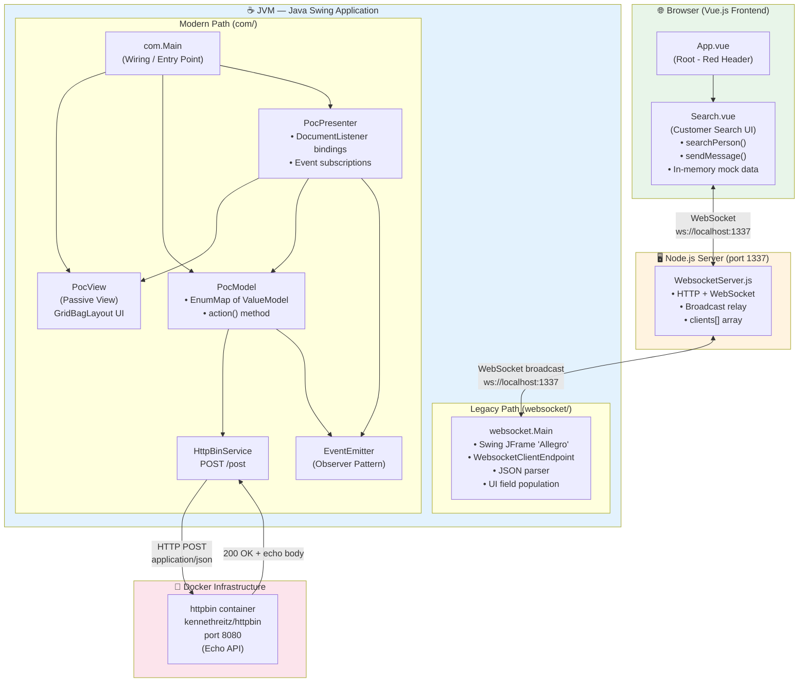

# Arc42 Architecture Documentation — Allegro WebSocket Swing PoC

## 1. Introduction and Goals

The **Allegro WebSocket Swing PoC** demonstrates modernization of the Allegro social insurance administration desktop system. The system allows a web-based operator to search a customer database mock and transfer selected customer records directly into a legacy Java Swing form, automating manual data re-entry.

**Key quality goals:**
- Real-time data transfer between browser and desktop
- Desktop UI compatibility (Java Swing)
- Integration bridge between web and desktop technologies

---

## 2. Constraints

- Must interface with existing Allegro desktop form (Swing/Java)
- Backend data entry endpoint uses httpbin as echo service placeholder
- Java SDK ≥ 22 required; Node.js WebSocket relay required
- Development/PoC only — no production hardening

---

## 3. Context & Scope

| Actor | Interaction |
|---|---|
| Sachbearbeiter (Clerk) | Uses Vue browser UI to search, uses Swing form for submission |
| Allegro System | Represented by httpbin echo API (placeholder) |
| WebSocket Relay | Node.js server bridges browser and desktop |

---

## 4. Solution Strategy

A **WebSocket relay pattern** decouples the Vue.js search UI from the Java Swing client. The Node.js server acts as a dumb broadcast bus. The Java side implements an **MVP pattern** (`PocModel/PocView/PocPresenter`) for testability. A legacy monolithic entry point (`websocket/Main.java`) exists as the original prototype.

---

## 5. Building Block View (Level 1)

```
[Vue Search UI] ←→ [WS Relay :1337] ←→ [Swing WS Client] → [Allegro Form]
                                                    ↓
                                         [HTTP POST :8080/post]
```

### Architecture Diagram



---

## 6. Runtime View

- **Primary flow**: Vue search → WS message → Node relay → Swing client → form fields populated
- **Secondary flow**: Swing "Anordnen" → HTTP POST → httpbin response → form cleared

---

## 7. Deployment View

| Component | Runtime | Address |
|---|---|---|
| Vue.js Frontend | Browser | connects to localhost:1337 |
| Node.js WS Server | Node.js process | localhost:1337 |
| Java Swing App | Local JVM (Java 22+) | connects to localhost:1337 |
| httpbin | Docker container | localhost:8080 |

---

## 8. Cross-Cutting Concepts

- **JSON as integration protocol**: all WS messages are JSON `{target, content}`
- **Observer pattern**: EventEmitter decouples model→presenter notifications
- **In-memory search**: no DB dependency for PoC

---

## 9. Architecture Decisions

| Decision | Choice | Rationale |
|---|---|---|
| WS Library (Java) | Tyrus (javax.websocket) | JSR-356 standard, standalone client bundle |
| WS Library (Node) | `websocket` npm package | Lightweight, no framework overhead |
| JSON (Java) | javax.json streaming API | Available without Jackson/Gson dependency |
| UI Pattern | MVP (Passive View) | Enables unit testing of presenter/model |
| Search Logic | In-memory | PoC — avoids DB setup complexity |

---

## 10. Quality Scenarios

| Quality | Scenario | Current Solution |
|---|---|---|
| Integration | Clerk transfers customer in <2s | WS relay is synchronous broadcast |
| Maintainability | Add new field | Add to ModelProperties enum + bind() call |
| Testability | Test search logic | Vue component methods are pure JS — testable |
| Reliability | WS disconnect | No reconnect logic implemented |

---

## 11. Risks and Technical Debt

| Risk | Severity | Mitigation |
|---|---|---|
| Duplicate Swing UI code | High | Consolidate into single MVP path, remove websocket/Main.java |
| No real search backend | High | Replace mock data with REST/DB |
| Manual JSON parsing | Medium | Adopt Jackson ObjectMapper |
| No WebSocket in MVP path | Medium | Wire WS client into PocPresenter |
| Zero test coverage | High | Add JUnit 5 for model/presenter |
| No WS reconnect logic | Medium | Implement exponential backoff |
