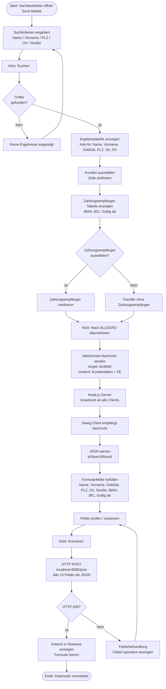

# BPMN Business Process — Allegro WebSocket Swing PoC

## Customer Data Transfer Process

```mermaid
flowchart TD
    Start([Start: Sachbearbeiter öffnet Such-Maske]) --> EnterSearch

    EnterSearch[Suchkriterien eingeben\nName / Vorname / PLZ / Ort / Straße] --> TriggerSearch
    TriggerSearch[Klick 'Suchen'] --> SearchLogic

    SearchLogic{Treffer\ngefunden?}
    SearchLogic -->|Nein| NoResult[Keine Ergebnisse angezeigt] --> EnterSearch
    SearchLogic -->|Ja| ShowResults[Ergebnistabelle anzeigen\nKdn-Nr, Name, Vorname, GebDat, PLZ, Str, Ort]

    ShowResults --> SelectCustomer[Kunden auswählen\nZeile anklicken]
    SelectCustomer --> ShowZahlungsempfaenger[Zahlungsempfänger-Tabelle anzeigen\nIBAN, BIC, Gültig ab]

    ShowZahlungsempfaenger --> SelectZE{Zahlungsempfänger\nauswählen?}
    SelectZE -->|Ja| ZESelected[Zahlungsempfänger markieren]
    SelectZE -->|Nein| TransferWithoutZE

    ZESelected --> ClickTransfer[Klick 'Nach ALLEGRO übernehmen']
    TransferWithoutZE[Transfer ohne Zahlungsempfänger] --> ClickTransfer

    ClickTransfer --> SendWS[WebSocket-Nachricht senden\ntarget: textfield\ncontent: Kundendaten + ZE]
    SendWS --> Relay[Node.js Server\nbroadcast an alle Clients]
    Relay --> SwingReceive[Swing Client empfängt Nachricht]

    SwingReceive --> ParseJSON[JSON parsen\ntoSearchResult]
    ParseJSON --> FillForm[Formularfelder befüllen\nName, Vorname, GebDat, PLZ, Ort, Straße, IBAN, BIC, Gültig ab]

    FillForm --> ReviewForm[Felder prüfen / anpassen]
    ReviewForm --> ClickAnordnen[Klick 'Anordnen']

    ClickAnordnen --> PostHTTP[HTTP POST\nlocalhost:8080/post\nAlle 13 Felder als JSON]
    PostHTTP --> APIResponse{HTTP 200?}
    APIResponse -->|Ja| ShowResponse[Antwort in Textarea anzeigen\nFormular leeren]
    APIResponse -->|Nein| ErrorState[Fehlerbehandlung\nFailed operation anzeigen]

    ShowResponse --> End([Ende: Datensatz verarbeitet])
    ErrorState --> ReviewForm
```
