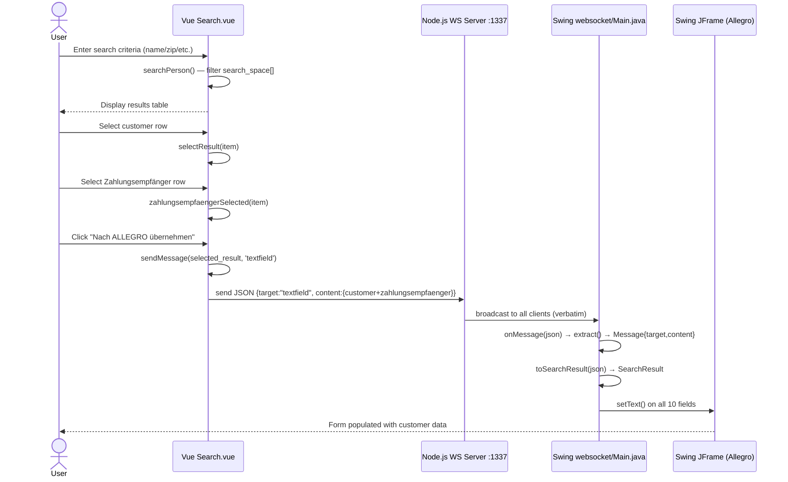
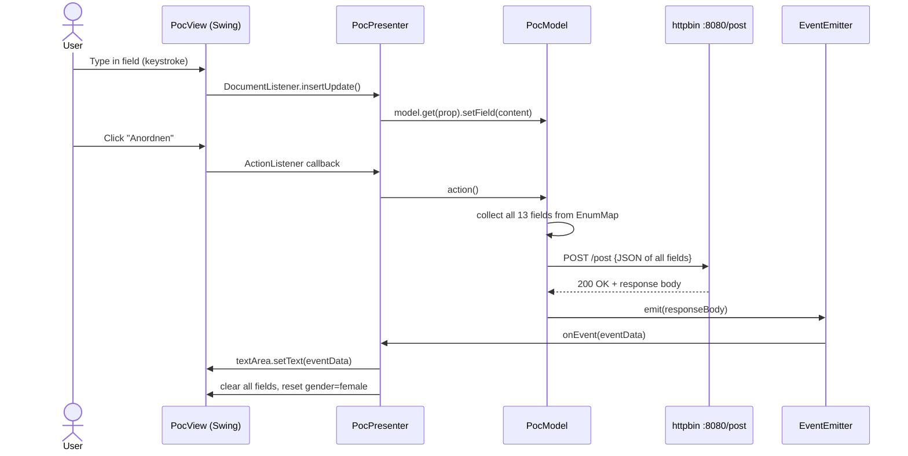
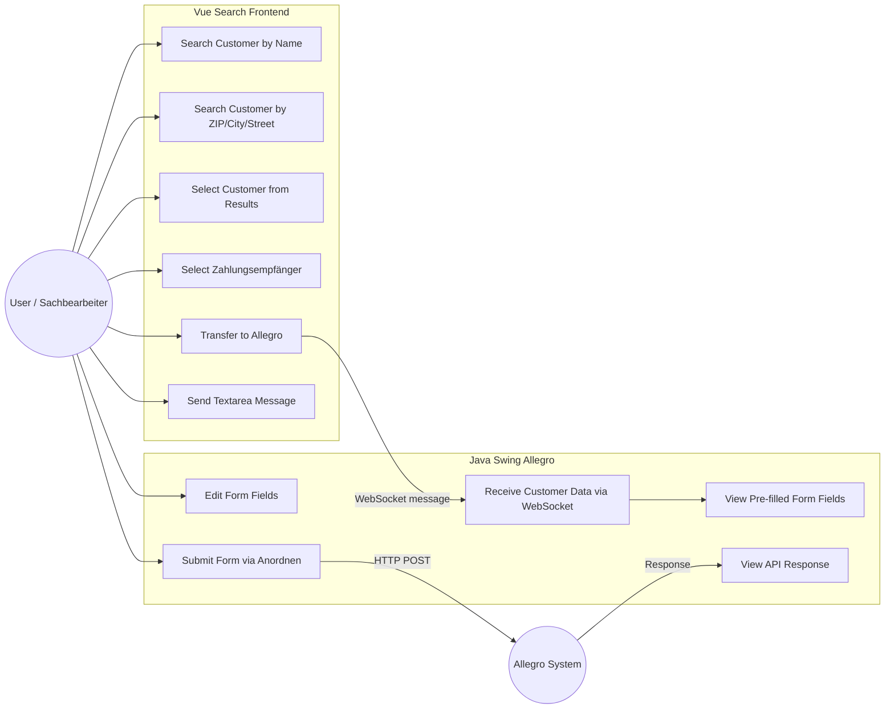

# UML Diagrams — Allegro WebSocket Swing PoC

## Class Diagram

```mermaid
classDiagram
    class Main_com {
        +main(String[] args)$
    }
    class Main_websocket {
        -CountDownLatch latch$
        -JFrame frame$
        -JTextField tf_name, tf_first, tf_dob...$
        -JRadioButton rb_female, rb_male, rb_diverse$
        -JsonParserFactory jsonParserFactory$
        +main(String[] args)$
        -initUI()$
        +toSearchResult(String json)$ SearchResult
    }
    class WebsocketClientEndpoint {
        -Session userSession
        +WebsocketClientEndpoint(URI)
        +onOpen(Session)
        +onClose(Session, CloseReason)
        +onMessage(String json)
        +sendMessage(String)
        +extract(String json)$ Message
    }
    class Message {
        +String target
        +String content
    }
    class SearchResult {
        +String name
        +String first
        +String dob
        +String zip
        +String ort
        +String street
        +String hausnr
        +String ze_iban
        +String ze_bic
        +String ze_valid_from
    }
    class PocView {
        +JFrame frame
        +JTextArea textArea
        +JTextField name, firstName, dateOfBirth
        +JTextField zip, ort, street, iban, bic, validFrom
        +JRadioButton female, male, diverse
        +ButtonGroup gender
        +JButton button
        +PocView()
        -initUI()
    }
    class PocPresenter {
        -PocView view
        -PocModel model
        +PocPresenter(PocView, PocModel, EventEmitter)
        -bind(JTextComponent, ModelProperties)
        -bind(JRadioButton, ModelProperties)
        -initializeBindings()
    }
    class PocModel {
        +Map~ModelProperties,ValueModel~ model
        -HttpBinService httpBinService
        -EventEmitter eventEmitter
        +PocModel(EventEmitter)
        +action() throws IOException, InterruptedException
    }
    class HttpBinService {
        +String URL = "http://localhost:8080"$
        +String PATH = "/post"$
        +post(Map~String,String~) String
    }
    class EventEmitter {
        -List~EventListener~ listeners
        +subscribe(EventListener)
        +emit(String eventData)
    }
    class EventListener {
        <<interface>>
        +onEvent(String eventData)
    }
    class ModelProperties {
        <<enumeration>>
        TEXT_AREA
        FIRST_NAME
        LAST_NAME
        DATE_OF_BIRTH
        ZIP
        ORT
        STREET
        IBAN
        BIC
        VALID_FROM
        FEMALE
        MALE
        DIVERSE
    }
    class ValueModel~T~ {
        -T field
        +ValueModel(T)
        +getField() T
        +setField(T)
    }

    Main_com --> PocView : creates
    Main_com --> EventEmitter : creates
    Main_com --> PocModel : creates
    Main_com --> PocPresenter : creates
    Main_websocket +-- WebsocketClientEndpoint
    Main_websocket +-- Message
    Main_websocket +-- SearchResult
    PocPresenter --> PocView : updates
    PocPresenter --> PocModel : calls action()
    PocPresenter --> EventEmitter : subscribes
    PocModel --> HttpBinService : uses
    PocModel --> EventEmitter : emits
    PocModel --> ValueModel : stores in map
    PocModel --> ModelProperties : keys
    EventEmitter --> EventListener : notifies
```

---

## Sequence Diagram — Customer Transfer Flow



---

## Sequence Diagram — Allegro Form Submission (MVP Path)



---

## Use Case Diagram


